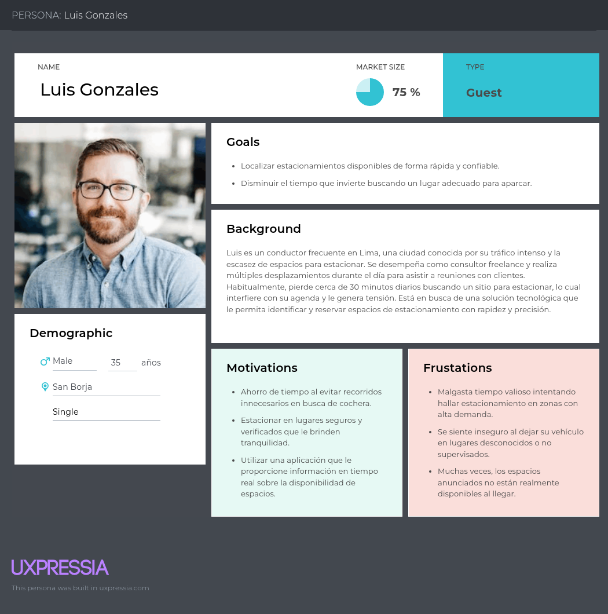
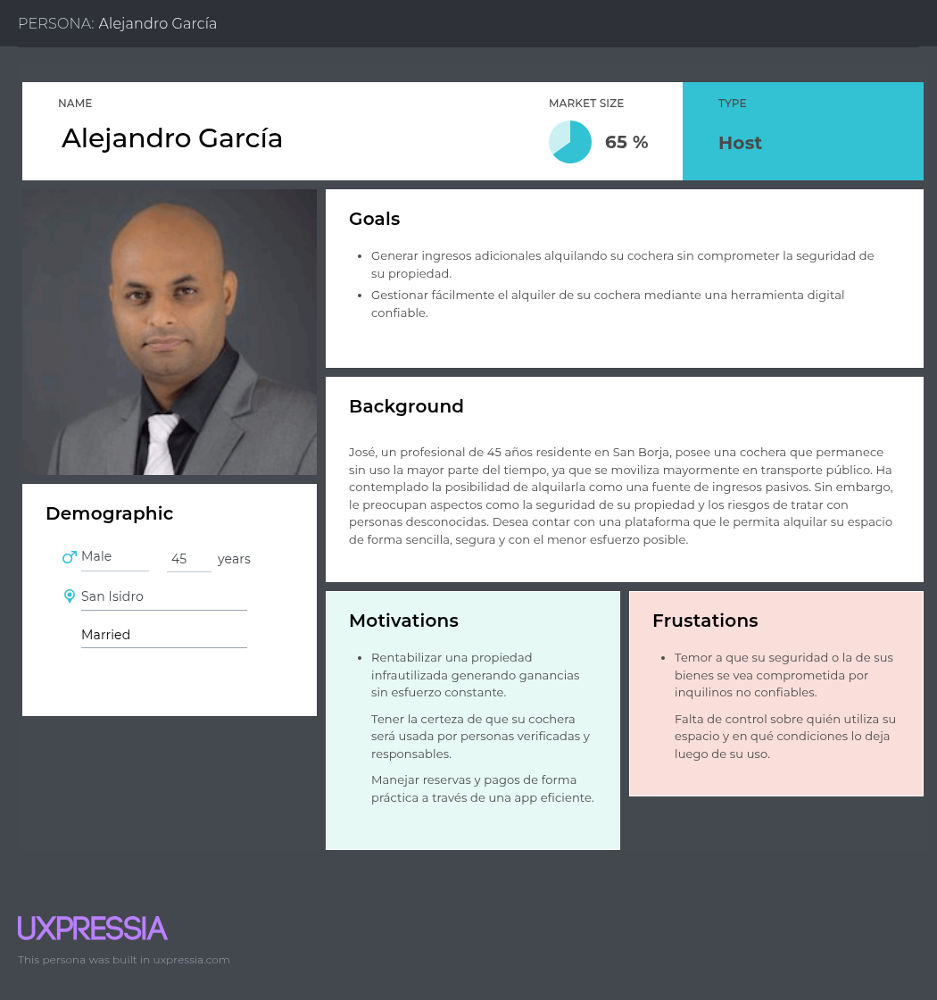
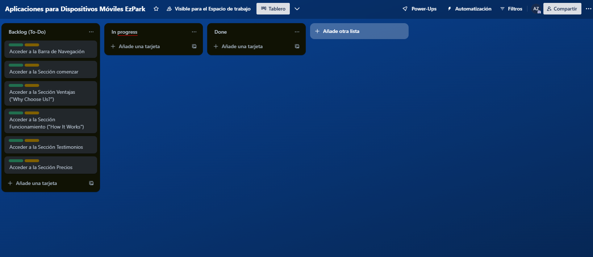
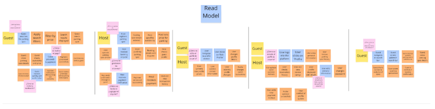
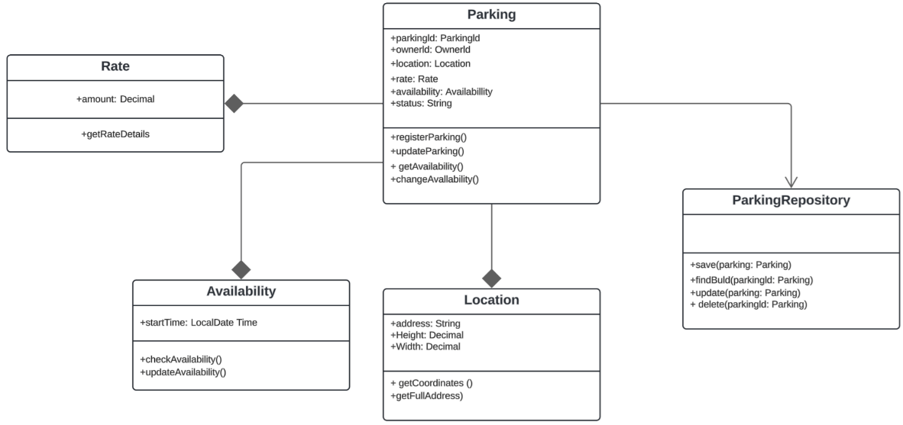
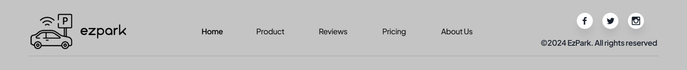
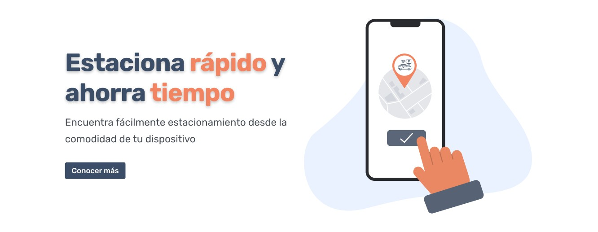
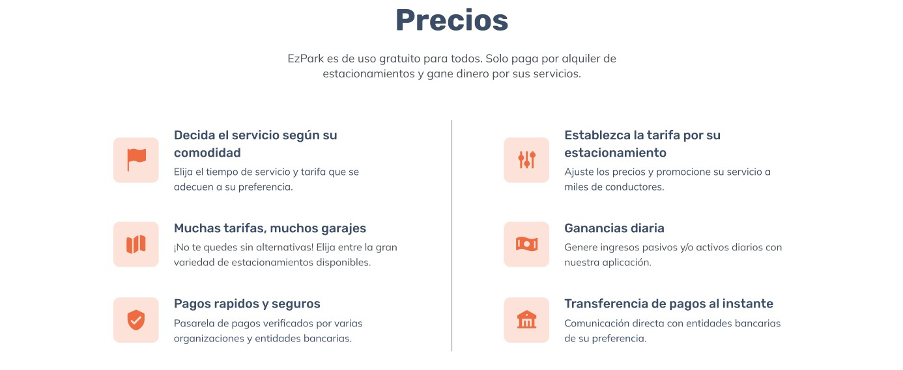

# 
Informe de Trabajo Final

## 
Universidad Peruana de Ciencias Aplicadas

  

Ingeniería de Software

Aplicaciones para Dispositivos Móviles - 366

<strong>Docente:</strong> David Gerardo Quevedo Velasco

<strong>Startup:</strong> ParkTeam

<strong>Producto:</strong> EzPark

<strong>Team members:</strong>

| Nombre                            | Código     |
| --------------------------------- | ---------- |
| Alonso Garay, Diego Jesus        | U20201C410|
| Oliveira Paucar, Mauricio         | U201719831 |
| Rodriguez Zuluoeta, Andres Fernando  | U20201F140 |
 

<strong>Ciclo 2025-10</strong>

# Registro de Versiones del Informe

| Versión |   Fecha    | Autor | Descripción de modificación | 
|:-------:|:----------:|:-----:|:----------------------------| 
|TB1      |      23/04/2025      |    ParkTeam   |    Se hizo la entrega del primer avance del Informe, desde la presentacion de la startup, hasta el capitulo 4 y las primeras conclusiones.                         |
|TP|       14/05/2025      |    ParkTeam   |    Se hizo la entrega del segundo avance del Informe, Se dearrollaron los capitulos 5 y 6, la landing page y el primer avance del proyecto.|
# Project Report Collaboration Insights

# Contenido
- [**Student Outcome**](#student-outcome)
- [**Objetivos SMART**](#objetivos-smart)
- [**Capítulo I: Presentación**](#capítulo-i-presentación)
- [1.1. Startup Profile](#11-startup-profile)
- [1.1.1. Descripción de la Startup](#111-descripción-de-la-startup)
- [1.1.2. Perfiles de integrantes del equipo](#112-perfiles-de-integrantes-del-equipo)
- [1.2. Solution Profile](#12-solution-profile)
- [1.2.1. Antecedentes y problemática](#121-antecedentes-y-problemática)
- [1.2.2. Lean UX Process](#122-lean-ux-process)
- [1.2.2.1. Lean UX Problem Statements](#1221-lean-ux-problem-statements)
- [1.2.2.2. Lean UX Assumptions](#1222-lean-ux-assumptions)
- [1.2.2.3. Lean UX Hypothesis Statements](#1223-lean-ux-hypothesis-statements)
- [1.2.2.4. Lean UX Canvas](#1224-lean-ux-canvas)
- [1.3. Segmentos objetivo](#13-segmentos-objetivo)
- [**Capítulo II: Requirements Elicitation & Analysis**](#capítulo-ii-requirements-elicitation--analysis)
- [2.1. Competidores](#21-competidores)
- [2.1.1. Análisis competitivo](#211-análisis-competitivo)
- [2.1.2. Estrategias y tácticas frente a competidores](#212-estrategias-y-tácticas-frente-a-competidores)
- [2.2. Entrevistas](#22-entrevistas)
- [2.2.1. Diseño de entrevistas](#221-diseño-de-entrevistas)
- [2.2.2. Registro de entrevistas](#222-registro-de-entrevistas)
- [2.2.3. Análisis de entrevistas](#223-análisis-de-entrevistas)
- [2.3. Needfinding](#23-needfinding)
- [2.3.1. User Personas](#231-user-personas)
- [2.3.2. User Task Matrix](#232-user-task-matrix)
- [2.3.3. User Journey Mapping](#233-user-journey-mapping)
- [2.3.4. Empathy Mapping](#234-empathy-mapping)
- [2.3.5. As-is Scenario Mapping](#235-as-is-scenario-mapping)
- [2.4. Ubiquitous Language](#24-ubiquitous-language)
- [**Capítulo III: Requirements specification**](#capítulo-iii-requirements-specification)
- [3.1. To-Be Scenario Mapping.](#31-to-be-scenario-mapping)
- [3.2. User Stories.](#32-user-stories)
- [3.3. Impact Mapping.](#33-impact-mapping)
- [3.4. Product Backlog.](#34-product-backlog)
- [**Capítulo IV: Solution Software Design**](#capítulo-iv-solution-software-design)
- [4.1. Strategic-Level Domain-Driven Design](#41-strategic-level-domain-driven-design)
- [4.1.1. EventStorming](#411-eventstorming)
- [4.1.1.1. Candidate Context Discovery](#4111-candidate-context-discovery)
- [4.1.1.2. Domain Message Flows Modeling](#4112-domain-message-flows-modeling)
- [4.1.1.3. Bounded Context Canvases](#4113-bounded-context-canvases)
- [4.1.2. Context Mapping](#412-context-mapping)
- [4.1.3. Software Architecture](#413-software-architecture)
- [4.1.3.1. Software Architecture Context Level Diagrams](#4131-software-architecture-context-level-diagrams)
- [4.1.3.2. Software Architecture Container Level Diagrams](#4132-software-architecture-container-level-diagrams)
- [4.1.3.3. Software Architecture Deployment Diagrams](#4133-software-architecture-deployment-diagrams)
- [4.2. Tactical-Level Domain-Driven Design](#42-tactical-level-domain-driven-design)
- [4.2.1. Bounded Context: User Management](#421-bounded-context-user-management)
- [4.2.1.1. Domain Layer](#4211-domain-layer)
- [4.2.1.2. Interface Layer](#4212-interface-layer)
- [4.2.1.3. Application Layer](#4213-application-layer)
- [4.2.1.4. Infrastructure Layer](#4214-infrastructure-layer)
- [4.2.1.5. Bounded Context Software Architecture Component Level Diagrams](#4215-bounded-context-software-architecture-component-level-diagrams)
- [4.2.1.6. Bounded Context Software Architecture Code Level Diagrams](#4216-bounded-context-software-architecture-code-level-diagrams)
- [4.2.1.6.1. Bounded Context Domain Layer Class Diagrams](#42161-bounded-context-domain-layer-class-diagrams)
- [4.2.1.6.2. Bounded Context Database Design Diagram](#42162-bounded-context-database-design-diagram)
- [4.2.2. Bounded Context: Parking Management ](#422-bounded-context-parking-management)
- [4.2.2.1. Domain Layer](#4221-domain-layer)
- [4.2.2.2. Interface Layer](#4222-interface-layer)
- [4.2.2.3. Application Layer](#4223-application-layer)
- [4.2.2.4. Infrastructure Layer](#4224-infrastructure-layer)
- [4.2.2.5. Bounded Context Software Architecture Component Level Diagrams](#4225-bounded-context-software-architecture-component-level-diagrams)
- [4.2.2.6. Bounded Context Software Architecture Code Level Diagrams](#4226-bounded-context-software-architecture-code-level-diagrams)
- [4.2.2.6.1. Bounded Context Domain Layer Class Diagrams](#42261-bounded-context-domain-layer-class-diagrams)
- [4.2.2.6.2. Bounded Context Database Design Diagram](#42262-bounded-context-database-design-diagram)
- [4.2.3. Bounded Context: Reservation Management Context ](#423-bounded-context-reservation-management-context)
- [4.2.3.1. Domain Layer](#4231-domain-layer)
- [4.2.3.2. Interface Layer](#4232-interface-layer)
- [4.2.3.3. Application Layer](#4233-application-layer)
- [4.2.3.4. Infrastructure Layer](#4234-infrastructure-layer)
- [4.2.3.5. Bounded Context Software Architecture Component Level Diagrams](#4235-bounded-context-software-architecture-component-level-diagrams)
- [4.2.3.6. Bounded Context Software Architecture Code Level Diagrams](#4236-bounded-context-software-architecture-code-level-diagrams)
- [4.2.3.6.1. Bounded Context Domain Layer Class Diagrams](#42361-bounded-context-domain-layer-class-diagrams)
- [4.2.3.6.2. Bounded Context Database Design Diagram](#42362-bounded-context-database-design-diagram)
- [**Capítulo V: Solution UI/UX Design**](#capítulo-v-solution-uiux-design)
- [5.1. Product design](#51-product-design)
- [5.1.1. Style Guidelines](#511-style-guidelines)
- [5.1.1.1. General Style Guidelines](#5111-general-style-guidelines)
- [5.1.2. Information Architecture](#512-information-architecture)
- [5.1.2.1. Organization Systems](#5121-organization-systems)
- [5.1.2.2. Labelling Systems](#5122-labelling-systems)
- [5.1.2.3. SEO Tags and Meta Tags](#5123-seo-tags-and-meta-tags)
- [5.1.2.4. Searching Systems](#5124-searching-systems)
- [5.1.2.5. Navigation Systems](#5125-navigation-systems)
- [5.1.3. Landing Page UI Design](#513-landing-page-ui-design)
- [5.1.3.1. Landing Page Wireframe](#5131-landing-page-wireframe)
- [5.1.3.2. Landing Page Mock-up](#5132-landing-page-mock-up)
- [5.1.4. Mobile Applications UX/UI Design](#514-mobile-applications-uxui-design)
- [5.1.4.1. Mobile Applications Wireframes](#5141-mobile-applications-wireframes)
- [5.1.4.2. Mobile Applications Wireflow Diagrams](#5142-mobile-applications-wireflow-diagrams)
- [5.1.4.3. Mobile Applications Mock-ups](#5143-mobile-applications-mock-ups)
- [5.1.4.4. Mobile Applications User Flow Diagrams](#5144-mobile-applications-user-flow-diagrams)
- [5.1.4.5. Mobile Applications Prototyping](#5145-mobile-applications-prototyping)
- [**Capítulo VI: Product Implementation, Validation & Deployment**](#capítulo-vi-product-implementation-validation--deployment)
- [6.1. Software Configuration Management](#61-software-configuration-management)
- [6.1.1. Software Development Environment Configuration](#611-software-development-environment-configuration)
- [6.1.2. Source Code Management](#612-source-code-management)
- [6.1.3. Source Code Style Guide & Conventions](#613-source-code-style-guide--conventions)
- [6.1.4. Software Deployment Configuration](#614-software-deployment-configuration)
- [6.2. Landing Page & Mobile Application Implementation](#62-landing-page--mobile-application-implementation)
- [6.2.1. Sprint 1](#621-sprint-1)
- [6.2.1.1. Sprint Planning 1](#6211-sprint-planning-1)
- [6.2.1.2. Sprint Backlog 1](#6212-sprint-backlog-1)
- [6.2.1.3. Development Evidence for Sprint Review](#6213-development-evidence-for-sprint-review)
- [6.2.1.4. Execution Evidence for Sprint Review](#6214-execution-evidence-for-sprint-review)
- [6.2.1.5. Services Documentation Evidence for Sprint Review](#6215-services-documentation-evidence-for-sprint-review)
- [6.2.1.6. Software Deployment Evidence for Sprint Review](#6216-software-deployment-evidence-for-sprint-review)
- [6.2.1.7. Team Collaboration Insights during Sprint](#6217-team-collaboration-insights-during-sprint)
- [Conclusiones](#conclusiones)
- [Conclusiones y recomendaciones.](#conclusiones-y-recomendaciones)
- [Video About-the-team](#video-about-the-team)
- [Bibliografía](#bibliografía)
- [Anexos](#anexos)

# Student Outcome

El curso contribuye al cumplimiento del Student Outcome ABET: 
**ABET - EAC - Student Outcome 7** 
- Criterio: La capacidad de adquirir y aplicar nuevos conocimientos según sea necesario, utilizando estrategias deaprendizaje apropiadas.
En elsiguiente cuadro se describe las accionesrealizadas y enunciados de conclusiones
por parte del grupo, que permiten sustentar el haber alcanzado el logro del ABET –
EAC - Student Outcome 7.
<table>
        <tr>
            <th>Criterio específico</th>
            <th>Acciones realizadas </th>
            <th>Conclusiones</th>
        </tr>
        <tr>
            <td>Actualiza conceptos y conocimientos necesarios para su desarrollo profesional y en especial para su proyecto en soluciones de software.</td>
            <td><strong>Alonso Garay, Diego Jesus</strong> 
            TB1 
            Desarrollé el capítulo 4 del proyecto EzPark. Aprendí a comprender los conceptos necesarios para desarrollar los diagramas presentes del capítulo correctamente. 
            TP 
            .... 
            <strong>Oliveira Paucar, Mauricio</strong> 
            TB1 
            En esta entrega realice el Capitulo 1 y algunos puntos del Capitulo 4. En estos puntos pude ver conceptos nuevos, pasados y mejorar aquellos puntos que creia necesarios con la ayuda de mi docente. 
            TP 
            Diseñé los style guidelines, Information architecture y gran parte de los mockups de la aplicación móvil de EzPark. Además, contribuí al desarrollo del prototipo funcional de la mobile application. 
            <strong>Rodriguez Zuluoeta, Andres Fernando</strong> 
            TB1 
            Desarrollé los capítulos 2 y 3 del proyecto EzPark, incluyendo análisis de requerimientos, user stories, Impact Mapping y Domain Message Flow Modeling. Aprendí a aplicar conceptos como Bounded Context y flujos de dominio en un sistema real. 
            TP 
            Diseñé los wireframes y wireflows de la aplicación móvil de EzPark, centrándome en la experiencia de usuario (UX) para flujos clave como reserva de estacionamientos y pagos. Además, contribuí al desarrollo de la landing page y al prototipo funcional de la mobile application. 
            </td>
            <td>El proyecto permitió al equipo adquirir nuevos conocimientos sobre modelado de dominio y diseño de soluciones, herramientas fundamentales para el desarrollo profesional en ingeniería de software." 
            </td>
        </tr>
        <tr>
            <td>Reconoce la necesidad del aprendizaje permanente para el desempeño profesional y el desarrollo de proyectos en soluciones de software.</td>
            <td><strong>Alonso Garay, Diego Jesus</strong> 
            TB1 
            Durante el desarrollo del trabajo aprendimos puntos importantes sobre la colaboración y sobre como se debe investigar para la elaboración de un buen proyecto. 
            TP 
            .... 
            <strong>Oliveira Paucar, Mauricio</strong> 
            TB1 
            En todo momento del trabajo se aprendio nuevas cosas y mejoramos lo que ya creaiamos correcto, ya que con el tiempo algunas cosas se actulizan y tenemos que estar en constante aprendizaje para poder entregar lo mejor en nuestros trabajos. 
            TP 
            Para esta entrega revisamos conceptos previos sobre ux/ui para poder implementar las mejores practicas al momento de desarrollar los estilos y prototipados necesarios para el proyecto. 
            <strong>Rodriguez Zuluoeta, Andres Fernando</strong> 
            TB1 
            Investigué por mi cuenta sobre Impact Mapping y Bounded Context, usando documentación y ejemplos externos, aplicando estrategias de autoaprendizaje para completar correctamente mi parte del proyecto. 
            TP 
            Durante esta entrega, identificué la necesidad de aprender sobre patrones de diseño móvil para garantizar la calidad del producto. Esta experiencia reforzó mi convicción de que la actualización constante es clave para enfrentar desafíos técnicos y aportar soluciones innovadoras en equipo." 
            </td>
            <td>El equipo comprendió que el aprendizaje continuo es esencial para enfrentar desafíos reales en proyectos, y que es necesario mantenerse actualizado de manera constante para seguir creciendo profesionalmente. </td>
        </tr>
    </table>

# Objetivos SMART

**Oliveira Paucar, Mauricio**

**Objetivo 1**
- Nos centramos en trabajar como desarrollador backend con Python para crear API seguras y eficientes para la gestión de usuarios.
- Creemos que ofrece experiencias de incorporación y autenticación más rápidas para los usuarios finales en plataformas digitales pequeñas y medianas.
- Esto se confirmará cuando las API que desarrollo se implementen y utilicen en producción con comentarios positivos de los usuarios o métricas de control de calidad.

**Objetivo 2** 
- Nos centramos en completar tres bootcamps centrados en backend que abarcan autenticación, diseño RESTful y arquitectura de sistemas.
- Creemos que proporciona una sólida base de conocimientos para crear soluciones escalables para plataformas web y móviles.
- Esto se confirmará cuando complete los bootcamps y aplique esos conceptos en un proyecto de demostración validado por colegas técnicos.

**Alonso Garay, Diego Jesús**

**Objetivo 1**

- Nos centramos en desarrollar y lanzar un MVP para una aplicación de movilidad urbana inspirada en la propuesta de valor de EzPark.
- Creemos que ofrece mayor accesibilidad y comodidad para los conductores que buscan aparcamiento de corta estancia en zonas concurridas.
- Esto se confirmará cuando el MVP se publique y sea utilizado por al menos 20 usuarios externos, tras recopilar sus comentarios.

**Objetivo 2**
- Nos centramos en completar un curso avanzado de diseño UX/UI y rediseñar la interfaz de una aplicación heredada.
- Creemos que ofrece mayor usabilidad y satisfacción del usuario para quienes utilizan aplicaciones basadas en servicios.
- Esto se confirmará cuando los usuarios reporten mayores tasas de éxito en las tareas o un NPS (Net Promoter Score) en las sesiones de prueba de usuario.

**Rodriguez Zuluoeta, Andrés Fernando**

 **Objetivo 1**  
 
- Nos centramos en aplicar el Diseño Orientado al Dominio en el desarrollo de un módulo de software real.
- Creemos que ofrece una arquitectura escalable y fácil de mantener que mejora la colaboración entre desarrolladores y partes interesadas en pequeñas empresas tecnológicas.
- Esto se confirmará cuando el módulo se implemente en un proyecto freelance o de código abierto y reciba una evaluación positiva de los colaboradores.

**Objetivo 2**
- Nos centramos en obtener una certificación de Scrum Master (PSM I) y aplicar prácticas ágiles en un equipo multifuncional.
- Creemos que ofrece mejora continua y coordinación eficaz del equipo en las etapas iniciales del desarrollo de productos.
- Esto se confirmará cuando apruebe la certificación y complete un ciclo ágil completo en un entorno de equipo real con retrospectivas y revisiones de sprint.

# Capítulo I: Presentación
## 1.1. Startup Profile
### 1.1.1. Descripción de la Startup

EzPark nace como respuesta a la creciente problemática de la escasez de espacios de estacionamiento en entornos urbanos. La congestión vehicular, sumada a la ineficiencia en la búsqueda de lugares disponibles para aparcar, genera frustración y retrasos, afectando la experiencia de los conductores a nivel global. Al mismo tiempo, los propietarios de espacios de estacionamiento no utilizados enfrentan la dificultad de encontrar una forma efectiva de monetizar estos activos.

El objetivo principal de EzPark es transformar la manera en que los usuarios encuentran y aprovechan los espacios de estacionamiento. Para ello, desarrollaremos una aplicación móvil con una interfaz intuitiva y amigable, que permitirá a los usuarios buscar, reservar y pagar por estacionamientos de manera ágil y eficiente. Los conductores podrán localizar fácilmente espacios disponibles cercanos a su destino, lo que les permitirá ahorrar tiempo y evitar la frustración derivada de una búsqueda ineficaz.

Por otro lado, los propietarios de espacios de estacionamiento tendrán la posibilidad de registrarse en la plataforma para poner a disposición sus cocheras o garajes para alquiler. La aplicación proporcionará herramientas para que los propietarios gestionen sus espacios, ajusten precios, establezcan horarios de disponibilidad y reciban pagos de forma segura. Este modelo permitirá a los propietarios optimizar el uso de sus activos y generar ingresos adicionales, mientras colaboran en la reducción de la congestión del tráfico urbano.

### 1.1.2. Perfiles de integrantes del equipo

|                                                                                 | Oliveira Paucar, Mauricio                                                                                                                                                                                                                                                                                                                                                                                                                               |
| ------------------------------------------------------------------------------- | ------------------------------------------------------------------------------------------------------------------------------------------------------------------------------------------------------------------------------------------------------------------------------------------------------------------------------------------------------------------------------------------------------------------------------------------------------- |
|  | <strong>Ingeniería de Software - U201719831</strong> Tengo 24 años, me gusta mucho aprender cosas nuevas sobre mi carrera, trabajar en equipo de manera proactiva y lograr los objetivos junto a mis compañeros. Me considero una persona ambiciosa, ya que mi meta es llegar a obtener un alto cargo en una empresa que me agrade o formar mi propia empresa relacionada al software. Gracias a ello siempre podré trabajar en algo que me guste. |

|                                                                                | Rodriguez Zuluoeta, Andres Fernando                                                                                                                                                                                                                                                                                                                                                                                                                                                                                                                             |
| ------------------------------------------------------------------------------ | ------------------------------------------------------------------------------------------------------------------------------------------------------------------------------------------------------------------------------------------------------------------------------------------------------------------------------------------------------------------------------------------------------------------------------------------------------------------------------------------------------------------------------------------------------ |
|  | <strong>Ingeniería de Software - U202124213</strong> Tengo 21 años, tengo conocimiento de lenguaje de programación como C ++ y Python. Me considero una persona centrada y responsable al momento de realizar trabajos en equipo. |

|                                                                                   | Alonso Garay, Diego Jesus                                                                                                                                                                                                                                                                                                                                                                                               |
| --------------------------------------------------------------------------------- | ------------------------------------------------------------------------------------------------------------------------------------------------------------------------------------------------------------------------------------------------------------------------------------------------------------------------------------------------------------------------------------------------------------------------------ |
|  | <strong>Ingeniería de Software - U20221d014</strong>  Tengo 22 años, tengo conocimiento en el uso de programas de edición como Photoshop y también sobre el uso de algunos lenguajes de programación. Por lo general siempre busco dar lo necesario para realizar un buen trabajo y presentar correctamente algún proyecto. |

## 1.2. Solution Profile
### 1.2.1. Antecedentes y problemática

Antecedentes

En la actualidad, las áreas urbanas experimentan un aumento constante en la congestión del tráfico debido al crecimiento de la población y al incremento del uso de vehículos motorizados.
Este problema de tráfico, agravado por la ineficiente búsqueda de espacios de estacionamiento, ha generado una experiencia frustrante para los conductores en todo el mundo. Además, esta situación también representa un desafío para quienes poseen espacios de estacionamiento no utilizados en áreas urbanas, ya que no cuentan con una plataforma efectiva para aprovechar estos activos.

Problemática

What?

La problemática percibida por nuestra startup es la escasez de espacios de estacionamiento en los entornos urbanos y la complejidad actual en la búsqueda de lugares para estacionar. Esto es debido a la alta demanda de vehículos motorizados para las actividades cotidianas.

When?

Esta preocupación ha estado aumentando a lo largo del tiempo, a medida que las ciudades han experimentado un crecimiento de la población y, por lo tanto, la cantidad de vehículos en circulación, la congestión de tráfico y la búsqueda ineficiente de estacionamiento se ha vuelto más apremiante en los últimos años.

Where?

El problema surge principalmente en áreas urbanas densamente pobladas de todo el mundo, donde el espacio es limitado y la demanda de vehículos es alta.

Who?

Los afectados por este problema son los conductores que enfrentan las dificultades para encontrar lugares de estacionamiento convenientes. Además, muchos propietarios de espacios de estacionamiento tienden a enfrentarse a empresas grandes dedicadas a este rubro, dificultando la promoción de sus servicios.

Why?

Esto ocurre debido a la insuficiencia de lugares de estacionamiento disponibles en áreas urbanas, lo que lleva a una congestión de tráfico más intensa y a la dificultad para los conductores de encontrar estacionamientos de manera oportuna.

How?

El problema sucede cuando la congestión del tráfico y la falta de espacios de estacionamiento disponibles conlleva a que la población tenga dificultades de encontrar estacionamientos de manera conveniente y eficiente.

How much?

El problema de la escasez de espacios de estacionamiento afecta de manera significativa a Lima, la capital, donde de acuerdo con un estudio realizado por la ONG Luz Ámbar en 2016 se ha demostrado que hay una insuficiencia de alrededor de 45,000 estacionamientos vehiculares en cinco distritos. Sin embargo, esta cifra resulta insuficiente en comparación con el tamaño del parque automotor de la ciudad, que consta de aproximadamente 1 millón 800,000 unidades. Esta disparidad entre la cantidad de vehículos y la disponibilidad de estacionamientos contribuye a la congestión del tráfico y al desafío constante para los conductores de encontrar lugares para estacionar de manera eficiente.

### 1.2.2. Lean UX Process
#### 1.2.2.1. Lean UX Problem Statements

En las zonas urbanas del Perú, la creciente demanda de espacios de estacionamiento ha generado una experiencia problemática tanto para los conductores como para los propietarios de garajes. Los conductores se enfrentan a una situación frustrante al buscar estacionamiento, perdiendo tiempo valioso y, en muchos casos, dejando sus vehículos en la vía pública, lo que genera riesgos innecesarios. Mientras tanto, los propietarios de cocheras tienen espacios vacíos que podrían ser alquilados para generar ingresos pasivos.

Actualmente, los conductores carecen de una forma eficiente y segura para encontrar estacionamientos disponibles cerca de su destino. Esto no solo aumenta el tiempo que invierten en la búsqueda de un lugar donde estacionar, sino que también contribuye a la congestión del tráfico. Por otro lado, los propietarios de cocheras tienen dificultades para aprovechar sus espacios debido a la inseguridad y desconfianza que sienten al permitir que personas desconocidas accedan a sus propiedades, que en muchos casos están integradas a sus viviendas.

Es necesario crear una solución que permita a los conductores encontrar de manera rápida y segura espacios de estacionamiento disponibles, mientras que, al mismo tiempo, ofrezca un entorno confiable y seguro para que los propietarios de cocheras puedan alquilar sus espacios sin temor a los riesgos asociados. La solución debe abordar las necesidades y preocupaciones de ambas partes sin comprometer la experiencia ni la seguridad de ninguna de ellas.

#### 1.2.2.2. Lean UX Assumptions

**<ins>Business Assumptions</ins>**

1. **Creo que mis usuarios necesitan** una mejor manera de encontrar lugares de estacionamientos y, de ser posible, reservarlos.
2. **Estas necesidades se pueden resolver** con una aplicación que les permite a los conductores reservar en los garajes de la ciudad, debido a que la mayoría del tiempo se encuentran desocupados o libres.
3. **Mis clientes iniciales son** los ciudadanos que cuenten con algún vehículo motorizado con dificultades para encontrar estacionamiento y/o deseen poner en alquiler sus garajes.
4. **El valor #1 que el cliente requiere de mi servicio** es encontrar y reservar espacios para estacionar en un corto periodo de tiempo. Además, los usuarios desean saber si esta metodología es totalmente segura para ambos tipos de usuario.
5. **Voy a adquirir a mis clientes a través de** estrategias de Marketing en diversas redes sociales, resaltando las principales características y beneficios de la aplicación.
6. **Mi competencia en el mercado** serán las empresas que se dedican a ofrecer sus servicios de estacionamiento.
7. **Los venceremos debido a que** ofrecemos a los usuarios poder generar ingresos de manera pasiva al rentar sus garajes como estacionamiento.
8. **Mis mayores riesgos del producto es** no encontrar una manera de brindar seguridad a los conductores como a los propietarios de los garajes.
9. **Resolveremos esto con** la incorporación de un sistema que se encargue de validar los parámetros de seguridad de los conductores y los garajes en alquiler para ofrecer una mayor seguridad al público.

**Sabremos que hemos tenido éxito cuando veamos los siguientes cambios en el comportamiento de nuestros clientes:**

- Reducción significativa en los tiempos de búsqueda de espacios disponibles para estacionar.
- Ingresos económicos en los propietarios con garajes registrados en la aplicación.

**¿Qué otras suposiciones tenemos que, de probarse falsas, pueden causar el fracaso del proyecto?**

- El permitir el acceso a cualquier usuario con propósitos malignos o perversos generará en todos los usuarios inseguridad. Por consiguiente, muchos de ellos dejarán la aplicación.

**<ins>User Assumptions</ins>**
**Clientes de parking**
¿Quién es el usuario?
Conductores que en su día a día necesitan encontrar estacionamiento para sus vehículos motorizados.

¿Dónde encaja nuestro servicio? ¿En su trabajo o en su vida?
Nuestro servicio encaja tanto para su trabajo como para sus actividades diarias. El usuario tiene la necesidad de encontrar un estacionamiento cercano a su puesto de trabajo. Asimismo, para otras actividades en algún punto específico de la ciudad desean tener su vehículo en un lugar cercano.

¿Qué problema tiene nuestro servicio y cómo se resuelve?
Problema será la posible inseguridad del usuario al alquilar en una cochera de cualquier persona desconocida.
Lo podemos resolver mediante un sistema de filtros que garanticen al usuario la seguridad de la cochera y contar con bases legales para la publicación del producto.

¿Cuándo y cómo es usado nuestro producto?
El producto es usado mayormente cuando el usuario necesita encontrar algún lugar de estacionamiento para cualquier actividad.
La aplicación se puede usar como un sistema de búsqueda y reserva de cocheras.

**Anfitriones de garajes**
¿Quién es el usuario?
Personas con garajes que desean poner en alquiler para generar ingresos pasivos.

¿Dónde encaja nuestro servicio? ¿En su trabajo o en su vida?
Nuestro servicio encaja en su vida porque pueden poner en alquiler sus garajes mientras realizan cualquier actividad.

¿Qué problema tiene nuestro servicio y cómo se resuelve?
El problema será el proceso para poder registrar sus cocheras, debido a que puede llegar a ser confuso o tedioso para el anfitrión.
Lo podemos resolver mediante capacitación sobre el proceso de filtros para facilitar al usuario el registro.

¿Cuándo y cómo es usado nuestro producto?
Nuestra aplicación es usada principalmente cuando el anfitrión dispone de cualquier garaje disponible que desee poner en alquiler para generar ingresos.
Nuestro producto es usado como un gestor de cocheras sobre reservas, estados, recibos, etc.

**<ins>Features</ins>**

¿Qué características son importantes?

- Hacer reservas de estacionamientos desde cualquier ubicación con conexión a internet, ya sea mediante un ordenador o un dispositivo móvil.
- Inscribir estacionamientos para alquilar y obtener ingresos adicionales según la tarifa establecida por el propietario.
- Verificar la disponibilidad de estacionamientos dentro de la zona o dirección especificada.

¿Cómo debe verse y comportarse nuestro producto?

- La interfaz de usuario contará con un diseño intuitivo, sencillo y atractivo, siguiendo las pautas de estilo específicas de nuestro sector.
- Se enfocará principalmente en la experiencia del usuario para garantizar una alta eficiencia en el funcionamiento de la aplicación.
- Estará disponible las 24 horas del día, los 7 días de la semana.
- Se respalda con una sólida arquitectura de software para abordar cualquier incidencia que pueda surgir.

#### 1.2.2.3. Lean UX Hypothesis Statements

- Creemos que la función de reservar cocheras facilitará al usuario encontrar un espacio para estacionamiento.
Sabremos que tendremos éxito cuando la mayoría de los usuarios consigan un estacionamiento en un plazo máximo de 5 minutos.

- Creemos que la implementación de Google Maps en la aplicación permitirá al usuario localizar las cocheras de manera más eficiente.
Sabremos que estaremos en lo cierto cuando el 100% de los usuarios no tengan dificultades para encontrar estacionamientos en la plataforma.

- Creemos que permitir que los usuarios registren sus cocheras incrementará la cantidad de espacios disponibles para estacionamiento.
Sabremos que estaremos en lo cierto cuando el índice de escasez de estacionamientos se reduzca en al menos un 20%.

#### 1.2.2.4. Lean UX Canvas

## 1.3. Segmentos objetivo

Nuestro segmento objetivo está compuesto por dos tipos de usuarios:

**Guest:** Individuo que busca soluciones convenientes y accesibles para sus necesidades de buscar estacionamiento en entornos urbanos para su vehículo.

**Host:** Propietario de una vivienda que cuente con una cochera privada que busque sacar provecho de forma efectiva de estos mismos.

# Capítulo II: Requirements Elicitation & Analysis
## 2.1. Competidores

En el mercado actual, varias aplicaciones buscan resolver el problema de estacionamiento en entornos urbanos, cada una con enfoques y modelos de negocio distintos. Nosotros hemos encontrado a estos competidores:
- EzPark 
- Apparka 
- Quadra 
- Parkopedia 

### 2.1.1. Análisis competitivo
EzPark se enfrentará a una competencia formada por aplicaciones móviles que facilitan la búsqueda y gestión de espacios de estacionamiento. A continuación, se presentan algunas de las más representativas en este rubro:
**Apparka**
Esta app peruana ofrece una solución innovadora para el alquiler temporal de cocheras privadas. A través de Apparka, los propietarios pueden registrar sus espacios disponibles y los conductores pueden encontrarlos fácilmente, pagar directamente desde la aplicación y evitar el tiempo perdido dando vueltas. Apparka se enfoca principalmente en zonas urbanas, promoviendo el uso eficiente de cocheras subutilizadas, una propuesta muy alineada al concepto de EzPark, aunque con un enfoque más cerrado en espacios privados formales.
**Quadra**
Esta app permite a los usuarios encontrar, comparar y alquilar cocheras en función de ubicación, precio y tiempo disponible. Su principal valor está en ofrecer múltiples opciones de estacionamiento a corto o largo plazo, ideal para usuarios que buscan flexibilidad. Aunque aún se encuentra en crecimiento, Quadra está ganando terreno gracias a su interfaz práctica y sistema de reservas con confirmación rápida. EzPark puede diferenciarse incorporando una experiencia de usuario más personalizada y una red más diversa que incluya espacios no tradicionales.
**Parkopedia**
Es una de las más completas a nivel mundial sobre estacionamientos, incluyendo tanto espacios públicos como privados. Proporciona información sobre tarifas, horarios, disponibilidad estimada y está integrada a sistemas de navegación en vehículos. Aunque su fortaleza es su alcance global (más de 15,000 ciudades), su enfoque es más informativo que transaccional. EzPark puede posicionarse como una opción más local e interactiva, centrada en la reserva y pago en tiempo real, especialmente adaptada a las necesidades del conductor peruano.

<table border="1">
  <thead>
        <tr>
      <th colspan="2">¿Por qué llevar a cabo este análisis?</th>
      <td colspan="4">El análisis competitivo es fundamental para comprender el entorno en el que se insertará EzPark, identificar brechas en el mercado, entender qué hacen bien los competidores y cómo diferenciarnos. A partir de esta evaluación, se pueden diseñar mejores estrategias de producto, marketing y expansión, alineadas con las necesidades reales del usuario y las oportunidades del sector.</td>
    </tr>
    <tr>
      <th colspan="2">Competidores</th>
      <th>EzPark </th>
      <th>Apparka </th>
      <th>Quadra </th>
      <th>Parkopedia </th>
    </tr>
  </thead>
  <tbody>
    <tr>
      <th rowspan="2">Perfil</th>
      <td>Overview</td>
      <td>Esta enfocada en resolver la escasez de estacionamientos urbanos mediante una app que permite a los usuarios buscar, reservar y pagar espacios de forma rápida y sencilla.</td>
      <td>Aplicación centrada en el alquiler temporal de cocheras privadas. Funciona como un marketplace entre propietarios y conductores.</td>
      <td>App móvil que permite buscar, comparar y alquilar cocheras en función de ubicación, precio y disponibilidad horaria.</td>
      <td>Plataforma global que brinda información sobre estacionamientos públicos y privados, operativa en más de 15,000 ciudades.</td>
    </tr>
    <tr>
      <td>Ventaja competitiva ¿Qué valor ofrece a los clientes?</td>
      <td>Permitir a los usuarios encontrar y reservar cocheras privadas en tiempo real, reduciendo la congestión urbana y generando ingresos adicionales a los dueños de los espacios.</td>
      <td>Oferta formal y segura de espacios privados. Facilita ingresos pasivos para dueños de cocheras. Pago directo desde la app.
      </td>
      <td>Flexibilidad en tiempo de uso. Sistema de reservas rápidas y comparación de precios. Enfocada en eficiencia y experiencia de usuario.
      </td>
      <td>Amplia cobertura geográfica. Integración con sistemas de navegación y autos. Gran base de datos de tarifas, horarios y ubicación.
      </td>
    </tr>
    <tr>
      <th rowspan="2">Perfil de Marketing</th>
      <td>Mercado objetivo</td>
      <td>Conductores de vehículos particulares que deseen un estacionamiento. 
Propietarios de cocheras que desean generar ingresos pasivos alquilando sus espacios sin complicarse.
</td><td>Usuarios urbanos con auto y propietarios de cocheras formales</td><td>Conductores que buscan alternativas prácticas y flexibles</td><td>Conductores globales que requieren información rápida</td>
    </tr>
    <tr>
      <td>Estrategias de marketing</td>
      <td>Alianzas locales, redes sociales, promociones por uso, marketing boca a boca</td>
      <td>Enfoque B2C y B2B, convenios con edificios y condominios</td>
      <td>Publicidad en redes, UX optimizada, convenios con empresas</td>
      <td>SEO, integración en autos, posicionamiento por data útil</td>
    </tr>
    <tr>
      <th rowspan="3">Perfil de producto</th>
      <td>Productos & Servicios</td>
      <td>Plataforma móvil (App Android/iOS) para buscar y reservar cocheras. 
Sistema de pagos integrado y seguros.
</td>
      <td>Alquiler de cocheras privadas</td>
      <td>Alquiler por hora/día; comparación de espacios</td>
      <td>Búsqueda informativa (precios, horarios, disponibilidad)</td>
    </tr>
    <tr>
      <td>Precios & Costos</td>
      <td>Comisión por transacción; modelo freemium</td><td>Comisión al propietario / tarifa por uso</td><td>Tarifa por uso / comisión variable</td><td>Gratuito para usuarios; modelos B2B y licencias</td>
    </tr>
    <tr>
      <td>Canales de distribución (Web y/o Móvil)</td>
      <td>App móvil y Web</td><td>App móvil y Web</td><td>App móvil</td><td>Web y app móvil, integrada a navegadores</td>
    </tr>
    <tr>
      <th rowspan="4">Análisis SWOT</th>
      <td>Fortalezas</td>
      <td>Adaptado al mercado peruano. 
Oferta diversa (cocheras tradicionales y no tradicionales). 
Interfaz simple e intuitiva.
</td><td>Marca local reconocida. 
Oferta formal y legalizada.
Plataforma establecida.
</td><td>Comparación inteligente de precios y horarios. 
Experiencia de usuario moderna.
</td><td>Enorme base de datos global. 
Integración en navegadores y vehículos.
</td>
    </tr>
    <tr>
      <td>Debilidades</td>
      <td>En etapa inicial, falta de reputación/marca consolidada. 
Requiere masa crítica de usuarios y ofertantes.
</td><td>Limitada a espacios privados registrados. 
Poca flexibilidad para incluir otros tipos de espacios. 
No cubre zonas con menor desarrollo.
</td><td>Limitado a usuarios más tecnológicamente activos. 
Poca personalización local o cultural.
</td><td>No transaccional: no permite reservas ni pagos. 
Información a veces desactualizada. 
No adaptada a mercados específicos como Perú.
</td>
    </tr>
    <tr>
      <td>Oportunidades</td>
      <td>Crecimiento urbano y aumento del parque automotor. 

Espacios subutilizados disponibles en hogares y negocios. 
Falta de soluciones locales completas.
</td><td>Expansión a más ciudades. 

Integración con sistemas de movilidad urbana.
</td><td>Implementación de suscripciones o membresías. 

Expansión a flotas corporativas.
</td><td>Convertirse en marketplace. 

Asociaciones con startups locales para operar en nuevas regiones.
</td>
    </tr>
    <tr>
      <td>Amenazas</td>
      <td>Competencia de apps ya posicionadas. Regulaciones sobre el uso comercial de espacios privados. Desconfianza inicial de usuarios.
      </td><td>Nuevos competidores con propuestas más flexibles.Saturación de espacios en zonas céntricas
      </td><td>Competidores con enfoque local más profundo. Problemas de confianza entre usuario y proveedor.
      </td><td>Apps locales más funcionales y enfocadas. Cambios rápidos en el comportamiento de los usuarios urbanos.
      </td>
    </tr>
  </tbody>
</table>

### 2.1.2. Estrategias y tácticas frente a competidores

Para posicionarse de manera sólida frente a la competencia, ParkTeam, con su producto EzPark, ha desarrollado una serie de estrategias y tácticas preliminares que buscan contrarrestar las fortalezas de sus competidores, capitalizar sus debilidades y responder de forma inteligente al entorno de oportunidades y amenazas.  
En relación con las fortalezas de competidores como Apparka, Quadra y Parkopedia, EzPark plantea diferenciarse mediante una propuesta más flexible e inclusiva. Mientras Apparka prioriza cocheras privadas formales, nuestra app permitirá registrar espacios no tradicionales como patios de casas, negocios o terrenos, siempre con validación visual y geolocalización para asegurar la confianza. Frente a la interfaz comparativa de Quadra, EzPark buscará ofrecer una experiencia de usuario mucho más fluida y enfocada en la rapidez de reserva, permitiendo concretar una transacción en solo tres pasos. Asimismo, frente al alcance global y enfoque informativo de Parkopedia, nuestra solución se centrará en la interacción local, con reservas y pagos en tiempo real, ajustados a las dinámicas y preferencias del conductor peruano.  
Aprovechando las debilidades de estas plataformas, EzPark implementará una estrategia de democratización del espacio urbano. A diferencia de Quadra, que aún está limitado a usuarios muy digitales, nuestra aplicación incorporará un diseño accesible, tutoriales interactivos y soporte por WhatsApp para captar una audiencia más amplia. Mientras tanto, al no contar Parkopedia con funciones transaccionales, nuestro producto ofrecerá la posibilidad de pagar directamente desde la app con métodos populares como Yape, Plin y tarjetas, generando mayor comodidad y fidelización del usuario.  
Respecto a las oportunidades que ofrece el entorno, EzPark busca aprovechar el crecimiento constante del parque automotor urbano para posicionarse primero en distritos emergentes con alta congestión y escasa oferta de estacionamientos, como San Juan de Lurigancho o Los Olivos. Además, estableceremos alianzas con negocios locales y comunidades vecinales para captar espacios subutilizados como cocheras temporales, promoviendo la economía compartida. En paralelo, exploraremos integraciones con aplicaciones de movilidad o delivery, generando sinergias que aumenten nuestra visibilidad y valor percibido.  
Frente a las amenazas, como la posible entrada de nuevos actores al mercado o las regulaciones sobre el uso de espacios privados, ParkTeam implementará tácticas de fidelización temprana mediante programas de recompensas por invitaciones, uso frecuente y reseñas positivas. Además, nuestra app incorporará términos de uso claros, funcionalidades de contacto directo con propietarios y sistemas de calificación y reputación que ayuden a construir una comunidad segura y confiable. De esta forma, buscamos transformar potenciales riesgos en oportunidades para fortalecer la confianza y el crecimiento sostenible de la plataforma.  

## 2.2. Entrevistas
### 2.2.1. Diseño de entrevistas

**Segmento objetivo: Guest y Host**

1. ¿Cuál es su nombre?
1. ¿Que edad tiene?
1. ¿En qué distrito reside?
1. ¿A que se dedica?
1. ¿Actualmente cuenta con algún tipo de vehículo?
1. ¿Cuántas veces a la semana usa su auto?
1. ¿Tiene dificultad para encontrar estacionamiento?
1. ¿En qué distritos suele buscar con mayor frecuencia un estacionamiento?
1. ¿Cuáles cree que son las horas más difíciles para encontrar estacionamiento?
1. ¿Estaría dispuesto a utilizar una cochera diferente a la tradicional?
1. ¿Con qué frecuencia usaría este servicio?
1. ¿Cree que sería de utilidad una aplicación que le ayude a buscar de manera más eficiente estos tipos 1. de estacionamientos?
1. ¿Qué requisitos mínimos cree que deberían cumplir los estacionamientos para que se sienta seguro de 1. dejar su vehículo en dichos lugares?
1. ¿Cuenta usted con algún espacio de estacionamiento disponible en su hogar?
1. ¿Usted estaría dispuesto a alquilarlo? ¿Por qué?
1. ¿Cada cuánto tiempo alquilaría su cochera?
1. ¿Cree que sería de utilidad una aplicación que le ayude a alquilar y publicitar su espacio de una manera eficiente?

### 2.2.2. Registro de entrevistas

**Segmento objetivo: Guest y Host**

Segmento objetivo: Guest y Host
Entrevista 1: Juan Carlos Bodoque Bolaños (26 años - San Miguel) - 4 de abril del 2023
URL del video: [Entrevistas](https://upcedupe-my.sharepoint.com/:v:/g/personal/u20201c410_upc_edu_pe/ESO5uEQLJUpJv5oRx-H9DbgBQ2BZ0bczJgFh8GRWHVF6wA?nav=eyJyZWZlcnJhbEluZm8iOnsicmVmZXJyYWxBcHAiOiJPbmVEcml2ZUZvckJ1c2luZXNzIiwicmVmZXJyYWxBcHBQbGF0Zm9ybSI6IldlYiIsInJlZmVycmFsTW9kZSI6InZpZXciLCJyZWZlcnJhbFZpZXciOiJNeUZpbGVzTGlua0NvcHkifX0&e=duBHCs) (Comienzo 00:32:16 - Fin 00:37:06)

Resumen:
Después de entrevistar a Juan Carlos Bodoque Bolaños, un abogado de 26 años residente en el distrito de San Miguel, se han obtenido detalles significativos sobre sus necesidades y preferencias en relación con el estacionamiento. Juan Carlos mencionó tener dificultades para encontrar estacionamiento en su centro de labores en el distrito de San Isidro, así como en zonas turísticas como Miraflores. Destacó que los horarios laborales presentan mayores desafíos para encontrar estacionamiento. Expresó interés en utilizar una plataforma de alquiler de espacios de estacionamiento sí ofrece beneficios económicos y afirmó que la utilizaría diariamente durante los días laborales. En términos de seguridad, señaló la importancia de verificar la identidad de los ocupantes de los espacios y la presencia de agentes de seguridad.
Por otro lado, reveló que tiene dos espacios de estacionamiento disponibles en su hogar y estaría dispuesto a alquilar uno de ellos en todo momento, ya que rara vez lo utiliza. Sugirió que sería útil tener la función de alquiler de espacios de estacionamiento junto con la búsqueda de espacios disponibles en una misma plataforma para mayor eficiencia y para generar ganancias adicionales.

---

Segmento objetivo: Guest y Host
Entrevista 2: Liliana Fu Ye (22 años - Jesús María) - 4 de abril del 2023
URL del video: [Entrevistas](https://upcedupe-my.sharepoint.com/:v:/g/personal/u20201c410_upc_edu_pe/ESO5uEQLJUpJv5oRx-H9DbgBQ2BZ0bczJgFh8GRWHVF6wA?nav=eyJyZWZlcnJhbEluZm8iOnsicmVmZXJyYWxBcHAiOiJPbmVEcml2ZUZvckJ1c2luZXNzIiwicmVmZXJyYWxBcHBQbGF0Zm9ybSI6IldlYiIsInJlZmVycmFsTW9kZSI6InZpZXciLCJyZWZlcnJhbFZpZXciOiJNeUZpbGVzTGlua0NvcHkifX0&e=duBHCs) (Comienzo 00:16:00 - Fin 00:22:02)

Resumen:
Después de entrevistar a Liliana Fu Ye, una estudiante de 22 años de Ingeniería de Software en la UPC y practicante en el banco Interbank, se han recopilado detalles importantes sobre sus hábitos de estacionamiento y sus preferencias en cuanto a la utilización de espacios de estacionamiento. Liliana mencionó que reside en el distrito de Jesús María y utiliza un vehículo prestado por su madre para desplazarse al trabajo y hacer compras los fines de semana en el distrito del Callao. Suele visitar los distritos de San Isidro y el Callao. Identificó las horas laborales y las ocasiones en las que almuerza con amigos en Miraflores como momentos difíciles para encontrar estacionamiento. Expresó su disposición para utilizar un estacionamiento privado y consideró útil una aplicación que muestre estos lugares, ya que actualmente se apoya en GPS que no son precisos para este propósito.
En cuanto a seguridad, sugirió que los estacionamientos deberían ubicarse en lugares privados o contar con personal vigilante en caso de ser públicos. Reveló que tiene dos espacios de estacionamiento en su hogar, pero solo utiliza uno y estaría dispuesta a alquilar el espacio no utilizado de manera indefinida, ya que su padre se ha mudado a otra ciudad con su vehículo. Propuso que la función de alquilar espacios propios esté integrada en la misma aplicación que ayuda a buscar espacios de otros usuarios para mayor comodidad. En cuanto a la tarifa de alquiler mensual, sugirió un precio aproximado de 300 soles, y consideraría cobrar por horas a partir de 5, aunque requiere una deliberación más detenida sobre esta opción.

---

Segmento objetivo: Guest y Host
Entrevista 3: Leonardo Jesús Vargas Navarro (26 años - Ate) - 5 de abril del 2024
URL del video: [Entrevistas](https://upcedupe-my.sharepoint.com/:v:/g/personal/u20201c410_upc_edu_pe/ESO5uEQLJUpJv5oRx-H9DbgBQ2BZ0bczJgFh8GRWHVF6wA?nav=eyJyZWZlcnJhbEluZm8iOnsicmVmZXJyYWxBcHAiOiJPbmVEcml2ZUZvckJ1c2luZXNzIiwicmVmZXJyYWxBcHBQbGF0Zm9ybSI6IldlYiIsInJlZmVycmFsTW9kZSI6InZpZXciLCJyZWZlcnJhbFZpZXciOiJNeUZpbGVzTGlua0NvcHkifX0&e=duBHCs) (Comienzo 00:00:00 - Fin 00:09:09)

Resumen:
Después de entrevistar a Leonardo Jesús Vargas Navarro, un ingeniero civil de 26 años que trabaja actualmente en la empresa D'site Perú y que reside en el distrito de Ate Vitarte, pudimos informarnos sobre su rutina semanal que tiene para con su vehículo y algunas preferencias que tiene a la hora de usar espacios de estacionamiento. Más adelante, Leonardo nos comenta que es dueño de un Hyundai Sedán y cuenta con un garaje para el mismo en su hogar.
En cuanto a sus destinos frecuentes, él suele ir con su vehículo hasta el distrito de San Miguel por temas de trabajo, además de pasear de vez en cuando por distritos como San Isidro o La Molina. Luego, nos comentó que es un poco más complicado conseguir espacios de estacionamiento en las mañanas y al mediodía. Por otro lado, nos expresó que le parecía buena la idea de utilizar un estacionamiento privado, especialmente para los días que va a trabajar.
Sin embargo, identificó algunos aspectos de seguridad que podrían ser útiles para la aplicación, como el hecho de saber quién alquila el espacio privado o que estos espacios existan solo en distritos "no tan movidos". Sobre su disponibilidad para rentar alquilar su espacio de estacionamiento privado,

---

Segmento objetivo: Guest y Host
Entrevista 4: Jesus Pedro Casana (San Miguel) - 5 de Abril, 2024
URL del video: [Entrevistas](https://upcedupe-my.sharepoint.com/:v:/g/personal/u20201c410_upc_edu_pe/ESO5uEQLJUpJv5oRx-H9DbgBQ2BZ0bczJgFh8GRWHVF6wA?nav=eyJyZWZlcnJhbEluZm8iOnsicmVmZXJyYWxBcHAiOiJPbmVEcml2ZUZvckJ1c2luZXNzIiwicmVmZXJyYWxBcHBQbGF0Zm9ybSI6IldlYiIsInJlZmVycmFsTW9kZSI6InZpZXciLCJyZWZlcnJhbFZpZXciOiJNeUZpbGVzTGlua0NvcHkifX0&e=duBHCs) (Comienzo 00:28:36 = Fin 00:32:15)

Terminada la entrevista a Jesus Pedro Casana, el nos comenta que es joven universitario que estudia y trabaja y cuenta con carro propio. Él es consciente que debido a su trabajo le demanda ir a varios distritos de Lima y casi la mayoría del tiempo no consigue un estacionamiento adecuado debido a la gran cantidad de vehículos estacionados que se encuentran por la zona. El también comenta que cuenta con una amplia cochera donde guarda su auto. El entrevistado manifestó su disposición a utilizar estacionamientos privados y reconoció el valor de una aplicación que facilite la visualización de estos lugares. Señaló que actualmente se apoya en sistemas de GPS que no son precisos para encontrar estacionamiento, por lo que considera útil una herramienta que le brinde información específica sobre los espacios disponibles en estacionamientos privados.

---

Segmento objetivo: Guest y Host
Entrevista 5: Edu Arturo Antayhua Ticona (San Miguel) - 6 de Abril, 2024
URL del video: [Entrevistas](https://upcedupe-my.sharepoint.com/:v:/g/personal/u20201c410_upc_edu_pe/ESO5uEQLJUpJv5oRx-H9DbgBQ2BZ0bczJgFh8GRWHVF6wA?nav=eyJyZWZlcnJhbEluZm8iOnsicmVmZXJyYWxBcHAiOiJPbmVEcml2ZUZvckJ1c2luZXNzIiwicmVmZXJyYWxBcHBQbGF0Zm9ybSI6IldlYiIsInJlZmVycmFsTW9kZSI6InZpZXciLCJyZWZlcnJhbFZpZXciOiJNeUZpbGVzTGlua0NvcHkifX0&e=duBHCs) (Comienzo 00:22:03 - Fin 00:28:35)

Se ha entrevistado a Edu Arturo Antayhua Ticona que tiene 21 años y trabaja de bartender. El menciona que usa su vehículo todos los días para ir a trabajar, estudiar y salir con su familia a pasear. Del mismo modo también dice que se le dificulta mucho salir a pasear con su vehículo ya que no encuentra un estacionamiento seguro por las zonas donde él normalmente se moviliza. También menciona que el uso de una aplicación con los servicios que mencionamos le serían de gran ayuda para su día a día..

---

Segmento objetivo: Guest y Host
Entrevista 6. Rodrigo Tornero Loayza (Santiago de Surco) - 6 de Abril, 2024
URL del video: [Entrevistas](https://upcedupe-my.sharepoint.com/:v:/g/personal/u20201c410_upc_edu_pe/ESO5uEQLJUpJv5oRx-H9DbgBQ2BZ0bczJgFh8GRWHVF6wA?nav=eyJyZWZlcnJhbEluZm8iOnsicmVmZXJyYWxBcHAiOiJPbmVEcml2ZUZvckJ1c2luZXNzIiwicmVmZXJyYWxBcHBQbGF0Zm9ybSI6IldlYiIsInJlZmVycmFsTW9kZSI6InZpZXciLCJyZWZlcnJhbFZpZXciOiJNeUZpbGVzTGlua0NvcHkifX0&e=duBHCs) (Comienzo 00:09:10 - Fin 00:15:59)

Se le ha realizado una entrevista a Rodrigo Tornero Loayza que cuenta con 21 años. El menciona que usó su vehículo de Lunes a Sábado para ir a la universidad y comprar algunas cosas que necesita para su universidad. El menciona también que durante la tarde cuando necesite un estacionamiento no hay debido a la alta demanda. El cree que usar la app que brinda nuestro servicio podría solucionar esos problemas y le ayudará a ahorrar un poco de tiempo. Respecto a los servicios de nuestra app, Rodrigo menciona que él considera viable la opción de alquilar una cochera a una persona si los estacionamiento se encuentran ocupados. Del mismo modo el dice que también sería capaz de alquilar su cochera si en algún momento no llegará a usarlo.

### 2.2.3. Análisis de entrevistas

- Los entrevistados han comentado que sería de mucha utilidad el uso de una aplicación con los servicios que nosotros ofrecemos. Además, ellos son conscientes de la dificultad para conseguir un estacionamiento seguro fuera de su domicilio debido a las altas frecuencias de robo de vehículos.

- El 100% de los entrevistados destacan como aspecto positivo de la integración de herramientas de software para el proceso de búsqueda de estacionamientos que se optimiza significativamente el tiempo que se destina a desarrollar el proceso.

- El 100% de los entrevistados denotan interés y expresaron la utilidad de la plataforma que busca ofrecer Testigos de Vue con JobSync. Especialmente, expresaron que sería de gran utilidad que las pequeñas y medianas empresas que suelen tener presupuesto limitado para la adquisición de estos tipos de software

- Un porcentaje de los entrevistados comentaron que el proceso de búsqueda resultaba ser tedioso/laborioso por la gran cantidad de posibles estacionamientos a encontrar y que algunos no sean de su entera confianza.

## 2.3. Needfinding
### 2.3.1. User Personas

**User Persona: Guest**
 

**User Persona: Host**

### 2.3.2. User Task Matrix

**User Persona: Guest(Luis Gonzales)**
|Actividad|Frecuencia de uso|Nivel de importancia|
|---------|-----------------|--------------------|
|Consultar en tiempo real los espacios de estacionamiento disponibles|Frecuente|Alta|
|Realizar la reserva de un lugar para estacionar|Frecuente|Alta|
|Revisar las condiciones de seguridad del estacionamiento antes de reservar|Ocasional|Alta|
|Cancelar una reserva previamente hecha|Poco frecuente|Media|
|Efectuar el pago del estacionamiento desde la misma plataforma|Frecuente|Alta|
|Dejar una calificación sobre la experiencia de estacionamiento|Ocasional|Media|
|Recibir notificaciones sobre espacios disponibles cercanos|Frecuente|Alta|

**User Persona: Host(Alejandro García)**
|Actividad|Frecuencia de uso|Nivel de importancia|
|---------|-----------------|--------------------|
|Publicar la disponibilidad de su cochera para alquiler en la app|Ocasional|Alta|
|Validar la identidad de los usuarios interesados en su cochera|Ocasional|Alta|
|Aceptar o rechazar solicitudes de reserva|Frecuente|Alta|
|Recibir pagos por los periodos de alquiler de su espacio|Frecuente|Alta|
|Atender solicitudes de cancelación de reservas|Poco frecuente|Media|
|Interactuar con los usuarios mediante el sistema de mensajería de la plataforma|Ocasional|Media|
|Actualizar datos e información sobre su cochera|Poco frecuente|Media|

### 2.3.3. User Journey Mapping

**User Persona: Guest**

**User Persona: Host**

### 2.3.4. Empathy Mapping
**User Persona: Guest**

**User Persona: Host**

### 2.3.5. As-is Scenario Mapping

**User Persona: Guest**

**User Persona: Host**

## 2.4. Ubiquitous Language

| **Término (EN)**     | **Término (ES)**           | **Definición**                                                                 |
|----------------------|----------------------------|--------------------------------------------------------------------------------|
| **Guest**            | Conductor                  | Usuario que busca estacionamiento en zonas urbanas a través de la app EzPark. |
| **Host**             | Anfitrión                  | Persona que posee cocheras y desea alquilarlas mediante EzPark.               |
| **Parking Space**    | Cochera / Espacio de estacionamiento | Área privada o semiprivada destinada al aparcamiento de un vehículo.   |
| **Reservation**      | Reserva                    | Acción mediante la cual un Guest asegura el uso temporal de una cochera.      |
| **Available Spot**   | Cochera disponible         | Espacio libre y apto para ser reservado, con ubicación, horario y tarifa.     |
| **Booking Request**  | Solicitud de reserva       | Pedido realizado por un Guest para utilizar una cochera en un horario dado.   |
| **Trusted Host**     | Anfitrión verificado       | Host que ha validado su identidad y confiabilidad en la plataforma.           |
| **Trusted Space**    | Cochera verificada         | Espacio que cumple requisitos de seguridad y ha sido validado por EzPark.     |
| **Time Slot**        | Franja horaria             | Intervalo de tiempo en el cual una cochera está habilitada para reservarse.   |
| **Parking Fee**      | Tarifa de estacionamiento  | Monto cobrado por el uso de una cochera según duración y horario.             |
| **Urban Congestion** | Congestión urbana          | Exceso de vehículos en zonas urbanas por falta de estacionamientos adecuados. |
| **Shared Parking**   | Estacionamiento compartido | Modelo donde los Hosts ofrecen sus cocheras temporalmente a otros usuarios.   |
| **Reservation History** | Historial de reservas   | Registro donde el usuario consulta sus reservas pasadas o activas.            |
| **Community Rating** | Calificación de la comunidad | Sistema de reseñas y puntuaciones tras completar una reserva.               |
| **Security Filter**  | Filtro de seguridad        | Mecanismo que verifica identidad de usuarios y condiciones de las cocheras.   |

# Capítulo III: Requirements specification
## 3.1. To-Be Scenario Mapping.

**User Persona: Guest**

**User Persona: Host**

## 3.2. User Stories.

#### **Epics**  

| **Epic ID** | **Título**                          | **Descripción**                                                                 |
|-------------|-------------------------------------|---------------------------------------------------------------------------------|
| EP01        | Desplegar Landing Page          | Mostrar componentes informativos y visuales de la página principal del producto.|
| EP02        | Gestionar Cuenta de Usuario     | Permitir registro, autenticación y gestión del perfil de usuarios.              |
| EP03        | Buscar y Reservar Estacionamientos | Facilitar la búsqueda, filtrado, reserva y gestión de estacionamientos.       |
| EP04        | Administrar Cocheras (Hosts)    | Habilitar la publicación, edición y gestión de espacios de estacionamiento.     |
| EP05        | Procesar Pagos                  | Gestionar transacciones, facturación y métodos de pago.                         |
| EP06        | Configurar Perfil de Usuario    | Permitir visualización y edición de datos personales, vehículos y preferencias.|
| EP07        | Garantizar Seguridad y Notificaciones | Implementar funciones de seguridad y notificaciones relevantes.              |

**User Stories**

| **User Story ID** | **Título** | **Descripción** | **Criterios de Aceptación** | **Relacionado con Epic ID** |
|-------------------|------------|-----------------|-----------------------------|---------------------|
| **US01** | **Acceder** a la Barra de Navegación | Como Guest, quiero usar una barra de navegación para ir a secciones clave. | **Escenario 1: Navegar a secciones** - Dado que estoy en el landing page - Cuando hago clic en "Cómo funciona" en la barra de navegación - Entonces soy redirigido a la sección EP04  **Escenario 2: Menú desplegable** - Dado que la barra de navegación tiene un menú hamburguesa (mobile) - Cuando hago clic en el ícono - Entonces se despliegan las opciones principales | EP01 |
| **US02** | **Acceder** a la Sección comenzar | Como Guest, quiero ver una introducción visual del servicio. | **Escenario 1: Visualización básica** - Dado que cargo la página principal - Cuando la sección comenzar se muestra - Entonces veo un título llamativo y un botón "Comenzar"  **Escenario 2: Redirección al registro** - Dado que estoy en la sección Hero - Cuando hago clic en "Comenzar" - Entonces soy redirigido al formulario de registro | EP01 |
| **US03** | **Acceder** a la Sección Ventajas ("Why Choose Us?") | Como Guest o Host, quiero conocer las razones para usar EzPark. | **Escenario 1: Mostrar ventajas** - Dado que estoy en la sección "Why Choose Us?" - Cuando reviso el contenido - Entonces veo 3 tarjetas con iconos y texto descriptivo  **Escenario 2: Responsividad** - Dado que accedo desde móvil - Cuando la sección se adapta - Entonces las tarjetas se apilan verticalmente | EP01 |
| **US04** | **Acceder** a la Sección Funcionamiento ("How It Works") | Como Guest o Host, quiero entender cómo usar la app. | **Escenario 1: Pasos claros** - Dado que estoy en "How It Works" - Cuando leo la información - Entonces identifico 3 pasos numerados con ilustraciones  **Escenario 2: Llamado a acción** - Dado que llego al final de la sección - Cuando veo el botón "Descargar ahora" - Entonces este me redirige a las app stores | EP01 |
| **US05** | **Acceder** a la Sección Testimonios | Como Guest, quiero ver opiniones de guests reales. | **Escenario 1: Testimonios auténticos** - Dado que reviso la sección - Cuando observo los testimonios - Entonces cada uno muestra foto, nombre y cargo/ubicación  **Escenario 2: Carrusel interactivo** - Dado que hay más de 3 testimonios - Cuando hago clic en "Siguiente" - Entonces se muestran nuevos testimonios con animación | EP01 |
| **US06** | **Acceder** a la Sección Precios | Como Guest, quiero conocer los costos de los servicios. | **Escenario 1: Planes comparativos** - Dado que veo la sección de precios - Cuando analizo las opciones - Entonces identifico al menos 3 planes con características diferenciadas  **Escenario 2: Destacar recomendado** - Dado que existe un plan recomendado - Cuando la página carga - Entonces este plan tiene un destacado visual (ej: borde colorido) | EP01 |
| **US07** | **Registrar** una Cuenta | Como Guest o Host, quiero crear una cuenta para acceder a la app. | **Escenario 1: Registro exitoso** - Dado que completo el formulario con datos válidos - Cuando hago clic en "Registrarme" - Entonces recibo un email de confirmación  **Escenario 2: Correo duplicado** - Dado que ingreso un email ya registrado - Cuando intento registrarme - Entonces el sistema muestra "Este correo ya está en uso" | EP02 |
| **US08** | **Iniciar** Sesión | Como Guest, quiero autenticarme de forma segura. | **Escenario 1: Login válido** - Dado que ingreso credenciales correctas - Cuando hago clic en "Ingresar" - Entonces accedo a mi dashboard  **Escenario 2: Credenciales inválidas** - Dado que ingreso una contraseña incorrecta - Cuando intento iniciar sesión - Entonces el sistema muestra "Credenciales no válidas" | EP02 |
| **US09** | **Recuperar** Contraseña | Como Guest, quiero restablecer mi contraseña si la olvido. | **Escenario 1: Solicitud exitosa** - Dado que ingreso mi email registrado - Cuando hago clic en "Recuperar" - Entonces recibo un enlace temporal al correo  **Escenario 2: Email no registrado** - Dado que ingreso un email no existente - Cuando solicito recuperación - Entonces el sistema muestra "Email no encontrado" | EP02 |
| **US10** | **Buscar** Estacionamientos Cercanos | Como Guest, quiero encontrar espacios disponibles cerca de mí. | **Escenario 1: Búsqueda por ubicación** - Dado que abro la app - Cuando ingreso mi ubicación actual - Entonces veo una lista de estacionamientos en un radio de 5 km  **Escenario 2: Sin resultados** - Dado que busco en una zona rural - Cuando no hay estacionamientos disponibles - Entonces el sistema muestra "No encontramos espacios en esta área" | EP03 |
| **US11** | **Filtrar** por Precio | Como Guest, quiero ajustar la búsqueda a mi presupuesto. | **Escenario 1: Filtro aplicado** - Dado que selecciono "Menos de S/10 por hora" - Cuando aplico el filtro - Entonces solo veo estacionamientos con precios ≤ S/10  **Escenario 2: Rango inválido** - Dado que ingreso un rango negativo (ej: -S/5) - Cuando intento filtrar - Entonces el sistema muestra "Ingrese un valor válido" | EP03 |
| **US12** | **Visualizar** Mapa Interactivo | Como Guest, quiero ver estacionamientos en un mapa. | **Escenario 1: Marcadores en mapa** - Dado que activo la vista de mapa - Cuando cargo la pantalla - Entonces los estacionamientos aparecen como marcadores azules  **Escenario 2: Marcador seleccionado** - Dado que hago clic en un marcador - Cuando se despliega el popup - Entonces muestra precio, distancia y botón "Reservar" | EP03 |
| **US13** | **Reservar** un Estacionamiento | Como Guest, quiero asegurar un espacio para mi vehículo. | **Escenario 1: Reserva exitosa** - Dado que selecciono un espacio disponible - Cuando confirmo la reserva y pago - Entonces recibo un código QR de acceso  **Escenario 2: Espacio ocupado** - Dado que otro Guest reserva primero - Cuando intento reservar - Entonces el sistema muestra "Este espacio ya no está disponible" | EP03 |
| **US14** | **Cancelar** una Reserva | Como Guest, quiero anular una reserva si no la necesito. | **Escenario 1: Cancelación a tiempo** - Dado que cancelo 1 hora antes - Cuando confirmo la acción - Entonces recibo un reembolso del 80%  **Escenario 2: Fuera de plazo** - Dado que intento cancelar 10 minutos antes - Cuando el plazo ya expiró - Entonces el sistema muestra "No puedes cancelar esta reserva" | EP03 |
| **US15** | **Consultar** Historial de Reservas | Como Guest, quiero ver mis reservas anteriores. | **Escenario 1: Historial completo** - Dado que accedo a "Mis reservas" - Cuando selecciono "Historial" - Entonces veo todas mis reservas pasadas ordenadas por fecha  **Escenario 2: Sin historial** - Dado que soy un Guest nuevo - Cuando reviso el historial - Entonces el sistema muestra "Aún no tienes reservas" | EP03 |
| **US16** | **Calificar** Experiencias | Como Guest, quiero evaluar estacionamientos después de usarlos. | **Escenario 1: Reseña completa** - Dado que finalizo una reserva - Cuando dejo 5 estrellas y un comentario - Entonces la reseña aparece en el perfil del estacionamiento  **Escenario 2: Reseña anónima** - Dado que selecciono "Publicar anónimamente" - Cuando envío la calificación - Entonces solo se muestra "Usuario verificado" en lugar de mi nombre | EP03 |
| **US17** | **Ver** Próximas Reservas | Como Guest, quiero conocer mis reservas futuras. | **Escenario 1: Reservas activas** - Dado que tengo 2 reservas pendientes - Cuando abro la sección - Entonces veo ambas con fechas y ubicaciones  **Escenario 2: Recordatorio automático** - Dado que tengo una reserva en 1 hora - Cuando el sistema detecta mi ubicación - Entonces recibo una notificación push "Tu reserva inicia pronto" | EP03 |
| **US18** | **Actualizar** Perfil | Como Guest, quiero editar mi información personal. | **Escenario 1: Cambio de teléfono** - Dado que modifico mi número - Cuando guardo los cambios - Entonces recibo un SMS de verificación  **Escenario 2: Foto de perfil** - Dado que subo una nueva foto - Cuando la imagen excede 5MB - Entonces el sistema muestra "El archivo es demasiado grande" | EP02 |
| **US19** | **Eliminar** Cuenta | Como Guest, quiero borrar mi cuenta permanentemente. | **Escenario 1: Confirmación requerida** - Dado que hago clic en "Eliminar cuenta" - Cuando ingreso mi contraseña para confirmar - Entonces todos mis datos se borran en 72 horas  **Escenario 2: Con reservas activas** - Dado que tengo una reserva pendiente - Cuando intento eliminar mi cuenta - Entonces el sistema bloquea la acción hasta completar la reserva | EP02 |
| **US20** | **Vincular** Métodos de Login | Como Guest, quiero asociar cuentas (Google/Facebook). | **Escenario 1: Vinculación exitosa** - Dado que selecciono "Google" - Cuando ingreso credenciales válidas - Entonces mi cuenta queda vinculada  **Escenario 2: Cuenta ya vinculada** - Dado que intento vincular Facebook otra vez - Cuando ya está asociado - Entonces el sistema muestra "Esta cuenta ya está conectada" | EP02 |
| **US21** | **Revisar** Detalles de Estacionamiento | Como Guest, quiero información completa antes de reservar. | **Escenario 1: Detalles clave** - Dado que selecciono un estacionamiento - Cuando abro su ficha - Entonces veo fotos, horarios, precio y reglas  **Escenario 2: Sin fotos** - Dado que el Host no subió imágenes - Cuando veo la ficha - Entonces se muestra un ícono de "Imagen no disponible" | EP03 |
| **US22** | **Listar** Estacionamientos | Como Guest, quiero ver opciones en formato de lista. | **Escenario 1: Ordenar por precio** - Dado que selecciono "Más barato primero" - Cuando la lista se actualiza - Entonces el primer resultado cuesta ≤ S/5  **Escenario 2: Sin conexión** - Dado que pierdo internet - Cuando intento cargar la lista - Entonces el sistema muestra datos en caché con alerta "Modo offline" | EP03 |
| **US23** | **Previsualizar** Entorno (Street View) | Como Guest, quiero ver el área del estacionamiento. | **Escenario 1: Integración con Google** - Dado que hago clic en "Ver ubicación" - Cuando se carga Street View - Entonces puedo navegar 360° alrededor del lugar  **Escenario 2: Zona no cubierta** - Dado que el estacionamiento está en una calle privada - Cuando intento abrir Street View - Entonces el sistema muestra "Vista no disponible" | EP03 |
| **US24** | **Publicar** una Cochera | Como Host, quiero ofrecer mi espacio para alquilar. | **Escenario 1: Publicación exitosa** - Dado que completo todos los campos obligatorios - Cuando subo fotos y confirmo - Entonces mi cochera aparece en búsquedas en 24h  **Escenario 2: Geolocalización fallida** - Dado que el GPS no detecta mi dirección - Cuando ingreso manualmente "Av. Perú 123" - Entonces el sistema sugiere "¿Quiso decir Av. Perú 125?" | EP04 |
| **US25** | **Modificar** Información de Cochera | Como Host, quiero actualizar los datos de mi espacio. | **Escenario 1: Cambio de horario** - Dado que edito "Horario de atención" - Cuando guardo los cambios - Entonces las reservas futuras se ajustan automáticamente  **Escenario 2: Precio inválido** - Dado que ingreso "S/0" como precio - Cuando intento guardar - Entonces el sistema muestra "El precio debe ser mayor a S/3" | EP04 |
| **US26** | **Ver** Cocheras Publicadas | Como Host, quiero revisar mis espacios en la plataforma. | **Escenario 1: Estado actualizado** - Dado que tengo 2 cocheras publicadas - Cuando abro "Mis espacios" - Entonces veo una como "Disponible" y otra como "Ocupado"  **Escenario 2: Filtro por estado** - Dado que selecciono "Mostrar solo ocupadas" - Cuando aplico el filtro - Entonces solo veo la cochera con reservas activas | EP04 |
| **US27** | **Eliminar** una Cochera | Como Host, quiero retirar un espacio de la plataforma. | **Escenario 1: Eliminación estándar** - Dado que no tengo reservas futuras - Cuando elimino la cochera - Entonces desaparece de los resultados de búsqueda  **Escenario 2: Con reservas pendientes** - Dado que tengo una reserva para mañana - Cuando intento eliminar - Entonces el sistema requiere que cancele primero la reserva | EP04 |
| **US28** | **Pagar** por Reserva | Como Guest, quiero realizar transacciones seguras. | **Escenario 1: Pago con tarjeta** - Dado que ingreso los datos de mi VISA - Cuando confirmo el pago de S/15 - Entonces recibo un comprobante por email  **Escenario 2: Tarjeta rechazada** - Dado que mi tarjeta tiene fondos insuficientes - Cuando intento pagar - Entonces el sistema muestra "Transacción rechazada" | EP05 |
| **US29** | **Descargar** Facturas | Como Guest, quiero obtener comprobantes de mis transacciones. | **Escenario 1: Factura en PDF** - Dado que selecciono una reserva pasada - Cuando hago clic en "Descargar factura" - Entonces se genera un PDF con logo de EzPark  **Escenario 2: Sin facturas** - Dado que soy un Guest nuevo - Cuando reviso "Mis facturas" - Entonces el sistema muestra "Aún no tienes transacciones" | EP05 |
| **US30** | **Guardar** Métodos de Pago | Como Guest, quiero almacenar tarjetas para futuros pagos. | **Escenario 1: Tarjeta guardada** - Dado que ingreso los datos de mi Mastercard - Cuando marco "Guardar para futuros pagos" - Entonces aparece en mi perfil como "•••• 4567"  **Escenario 2: Tarjeta expirada** - Dado que ingreso una tarjeta vencida - Cuando intento guardarla - Entonces el sistema muestra "Fecha de expiración inválida" | EP05 |
| **US31** | **Ver** Perfil | Como Guest, quiero acceder a mi información personal. | **Escenario 1: Datos básicos** - Dado que abro "Mi perfil" - Cuando la página carga - Entonces veo mi nombre, foto y correo electrónico  **Escenario 2: Edición rápida** - Dado que hago clic en "Editar" junto a mi nombre - Cuando modifico el campo - Entonces los cambios se guardan sin recargar la página | EP06 |
| **US32** | **Agregar** Vehículo | Como Guest, quiero registrar mi auto para reservas. | **Escenario 1: Auto registrado** - Dado que ingreso placa "ABC-123" y modelo "Toyota Yaris" - Cuando guardo - Entonces aparece en "Mis vehículos"  **Escenario 2: Placa inválida** - Dado que ingreso "XYZ-999" (placa no existente) - Cuando intento guardar - Entonces el sistema valida con la base de SUNARP | EP06 |
| **US33** | **Editar** Datos de Vehículo | Como Guest, quiero actualizar la información de mi vehículo. | **Escenario 1: Cambio de modelo** - Dado que modifico "Toyota Yaris" a "Toyota Corolla" - Cuando confirmo - Entonces todas mis reservas futuras reflejan el cambio  **Escenario 2: Sin cambios** - Dado que no modifico ningún campo - Cuando hago clic en "Guardar" - Entonces el sistema ignora la acción | EP06 |
| **US34** | **Eliminar** Vehículo | Como Guest, quiero borrar un vehículo registrado. | **Escenario 1: Eliminación confirmada** - Dado que selecciono "Eliminar" en un vehículo - Cuando confirmo la acción - Entonces desaparece de mi lista  **Escenario 2: Con reservas activas** - Dado que tengo una reserva pendiente para este auto - Cuando intento eliminarlo - Entonces el sistema muestra "No puedes eliminar un vehículo con reservas" | EP06 |
| **US35** | **Gestionar** Métodos de Pago | Como Guest, quiero ver y administrar mis tarjetas guardadas. | **Escenario 1: Lista de tarjetas** - Dado que tengo 2 tarjetas guardadas - Cuando abro "Métodos de pago" - Entonces veo ambas con sus últimos 4 dígitos  **Escenario 2: Predeterminar una tarjeta** - Dado que hago clic en "Establecer como predeterminada" - Cuando selecciono una VISA - Entonces aparece con un check verde en futuras compras | EP06 |
| **US36** | **Personalizar** Notificaciones | Como Guest, quiero elegir qué alertas recibir. | **Escenario 1: Desactivar notificaciones** - Dado que desmarco "Promociones" - Cuando guardo - Entonces dejo de recibir emails promocionales  **Escenario 2: Notificaciones push** - Dado que activo "Recordatorios de reserva" - Cuando tengo una reserva en 2 horas - Entonces recibo una alerta en mi móvil | EP06 |
| **US37** | **Recibir** Notificación de Reserva | Como Guest, quiero ser notificado al confirmar una reserva. | **Escenario 1: Notificación push** - Dado que completo una reserva - Cuando se confirma el pago - Entonces mi móvil muestra "¡Reserva confirmada en Av. Perú 123!"  **Escenario 2: Sin permisos** - Dado que tengo notificaciones desactivadas - Cuando hago una reserva - Entonces el sistema sugiere "Activa notificaciones para recibir alertas" | EP07 |
| **US38** | **Alertar** sobre Expiración | Como Guest, quiero un recordatorio antes de que venza mi reserva. | **Escenario 1: Alerta programada** - Dado que mi reserva termina en 30 minutos - Cuando el sistema detecta mi ubicación lejos del estacionamiento - Entonces recibo "Tu tiempo está por terminar"  **Escenario 2: Renovación automática** - Dado que activo "Renovar automáticamente" - Cuando el tiempo se agota - Entonces se cobra 1 hora adicional sin notificación | EP07 |
| **US39** | **Verificar** Identidad | Como Guest y Host, quiero que la app valide la identidad de Hosts/conductores. | **Escenario 1: Verificación de Host** - Dado que un Host sube su DNI y selfie - Cuando el sistema valida los datos - Entonces su perfil muestra un sello "Identidad verificada"  **Escenario 2: Documento rechazado** - Dado que subo una foto borrosa de mi DNI - Cuando el sistema no puede leerla - Entonces recibo "Sube una imagen más clara" | EP07 |

## 3.3. Impact Mapping.

**User Persona: Guest**

**User Persona: Host**

## 3.4. Product Backlog.

| # Orden | User Story ID | Título | Story Points |
|---------|---------------|--------|--------------|
|1| US13 | Reservar un Estacionamiento         | 8 |
|2| US07 | Registrar una Cuenta                | 5 |
|3| US08 | Iniciar Sesión                      | 3 |
|4| US10 | Buscar Estacionamientos Cercanos    | 5 |
|5| US12 | Visualizar Mapa Interactivo         | 8 |
|6| US39 | Verificar Identidad                 | 5 |
|7| US24 | Publicar una Cochera                | 5 |
|8| US28 | Pagar por Reserva                   | 5 |
|9| US22 | Listar Estacionamientos             | 3 |
|10| US21 | Revisar Detalles de Estacionamiento | 3 |
|11| US23 | Previsualizar Entorno (Street View) | 5 |
|12| US14 | Cancelar una Reserva                | 3 |
|13| US15 | Consultar Historial de Reservas     | 2 |
|14| US25 | Modificar Información de Cochera | 3 |
|15| US26 | Ver Cocheras Publicadas          | 2 |
|16| US27 | Eliminar una Cochera             | 3 |
|17| US30 | Guardar Métodos de Pago          | 3 |
|18| US29 | Descargar Facturas               | 2 |
|19| US11 | Filtrar por Precio               | 3 |
|20| US36 | Personalizar Notificaciones      | 2 |
|21| US37 | Recibir Notificación de Reserva  | 2 |
|22| US38 | Alertar sobre Expiración         | 3 |
|23| US17 | Ver Próximas Reservas            | 3 |
|24| US16 | Calificar Experiencias           | 2 |
|25| US18 | Actualizar Perfil                | 3 |
|26| US32 | Agregar Vehículo                 | 3 |
|27| US33 | Editar Datos de Vehículo         | 2 |
|28| US34 | Eliminar Vehículo                | 2 |
|29| US35 | Gestionar Métodos de Pago        | 3 |
|30| US09 | Recuperar Contraseña             | 3 |
|31| US20 | Vincular Métodos de Login        | 3 |
|32| US19 | Eliminar Cuenta                  | 3 |
|33| US02 | Acceder a la Sección comenzar       | 2 |
|34| US01 | Acceder a la Barra de Navegación    | 1 |
|35| US03 | Acceder a la Sección Ventajas       | 2 |
|36| US04 | Acceder a la Sección Funcionamiento | 3 |
|37| US05 | Acceder a la Sección Testimonios    | 2 |
|38| US06 | Acceder a la Sección Precios        | 3 |
|39| US31 | Ver Perfil                          | 1 |

### **Herramienta de Gestión del Product Backlog**
Para visualizar el Product Backlog de manera interactiva, se ha utilizado **Trello**. A continuación, se incluye una captura y el enlace público al tablero:

#### **Captura del Product Backlog en Trello**:

#### **Enlace al Tablero Público**:
[Product Backlog - EzPark en Trello](https://trello.com/invite/b/68088a638ddf51d42031db4d/ATTI4ac925397a9cda133d661ba7bb801c83AAE4F040/aplicaciones-para-dispositivos-moviles-ezpark)

# Capítulo IV: Solution Software Design
## 4.1. Strategic-Level Domain-Driven Design
### 4.1.1. EventStorming
En esta fase, se adoptó un enfoque colaborativo y visual para facilitar el modelado del contexto del dominio. Esto se logró mediante la exploración de etapas como el Candidate Context Discovery, Domain Message Flows Modeling y la creación de Bounded Context Canvases.

**Unstructured Exploration**

Este método utiliza una representación gráfica donde todos los involucrados en un proyecto se juntan para analizar a fondo cómo funciona un sistema. Para esto, se emplean notas de colores variados que simbolizan diferentes componentes, lo que hace más sencilla la conversación y la identificación de lo que se necesita.

**Pain Points**

Los pain points son esos obstáculos o complicaciones que experimentan tanto los usuarios como las personas interesadas en el sistema. Detectar estos problemas es crucial porque nos permite enfocarnos en crear funcionalidades y soluciones que de verdad resuelvan las necesidades de quienes van a usar el sistema.

**Timelines**

La línea de tiempo del sistema describe el orden en que suceden las cosas dentro de él. Al definir esta secuencia de eventos, podemos entender mejor cómo se relacionan las acciones y cómo impactan el desarrollo del trabajo.

**Pivotal Points**
Los puntos pivote son esos instantes cruciales dentro de la secuencia de eventos que tienen la capacidad de transformar la condición del sistema o de afectar de manera importante la vivencia del usuario. Reconocer estos momentos nos permite enfocar nuestras energías en las partes más trascendentales del proceso.

**Commands**

Los comandos son las acciones o las órdenes que un usuario o el mismo sistema pueden llevar a cabo para generar una modificación en cómo se encuentra el sistema en un momento dado.

**Policies**

Las políticas son los lineamientos o normas que definen la manera en que se deben tomar las decisiones dentro del sistema. Esto puede abarcar reglas de negocio que establecen el momento en que ciertos comandos deben ejecutarse o la forma en que ciertos eventos deben ser gestionados.

**Read Model**

Estos modelos se crean específicamente para que la búsqueda de datos sea rápida, y a menudo se diseñan de forma diferente a cómo se guardan los datos inicialmente para que el sistema funcione mejor y pueda manejar más trabajo.

**External Systems**

Los sistemas externos son aquellos otros sistemas o servicios con los que el sistema principal se comunica o trabaja en conjunto. Reconocer cuáles son estos sistemas nos ayuda a comprender qué conexiones y dependencias son necesarias para que todo funcione correctamente.

#### 4.1.1.1. Candidate Context Discovery

**User Managment:**

**Parking Managment:**

**Reservation Managment:**

#### 4.1.1.2. Domain Message Flows Modeling

**Scenario: User management**

**Scenario: Create Parking**

**Scenario: Reservation Management**

#### 4.1.1.3. Bounded Context Canvases

**User management**

**Parking Management**

**Reservation Management**

### 4.1.2. Context Mapping

El Bounded Context de User Management se encarga de toda la lógica relacionada con los usuarios y su información, la cual es utilizada tanto por Parking Management para gestionar la información de los administradores de los parkings, como por Reservation Management para identificar a los usuarios que realizan las reservas. A su vez, Parking Management se centra en la gestión de los parkings y su información, y Reservation Management es responsable de la lógica de negocio de las reservas, gestionando las reservas específicamente para los parkings administrados por el Bounded Context de Parking Management.

### 4.1.3. Software Architecture
#### 4.1.3.1. Software Architecture Context Level Diagrams

Este diagrama de contexto ilustra cómo los Guests y los Hosts interactúan directamente con el sistema EzPark para solicitar y ofrecer espacios de estacionamiento, respectivamente. Además, muestra cómo EzPark utiliza Google Cloud Storage para la gestión de datos de los usuarios. Es una representación de alto nivel de los límites del sistema y sus principales interacciones con el mundo exterior.

#### 4.1.3.2. Software Architecture Container Level Diagrams

Este diagrama muestra cómo los usuarios interactúan con EzPark a través de interfaces web y móviles. Estas interfaces se comunican con la Aplicaciones API, que contiene la lógica del negocio. La API interactúa con una Base de Datos para la gestión de usuarios y con Google Cloud Storage para el almacenamiento de datos específicos. Es una vista de la arquitectura de software del sistema EzPark.

#### 4.1.3.3. Software Architecture Deployment Diagrams

Este diagrama representa una arquitectura de software distribuida en la nube donde una Single-Page Application se ejecuta en navegadores web, mientras que una Aplicación Móvil permite a los usuarios realizar llamadas API desde dispositivos iOS o Android.

## 4.2. Tactical-Level Domain-Driven Design
### 4.2.1. Bounded Context: User Management
En este contexto, ParkTeam define los elementos fundamentales para la gestión de usuarios dentro de su producto EzPark. Este Bounded Context se enfoca en gestionar las entidades relacionadas con los usuarios, incluyendo su registro, autenticación, roles y perfiles.
#### 4.2.1.1. Domain Layer
En esta capa, se representan las reglas de negocio centrales del dominio de usuarios. Las clases identificadas son:
- User: Entidad que representa a un usuario del sistema, incluyendo atributos como identificador, correo electrónico, contraseña y rol.
- UserId: Objeto de valor que encapsula el identificador único del usuario.
- Email: Objeto de valor que asegura la validez del formato del correo electrónico.
- Password: Objeto de valor que maneja el hashing y la validación de contraseñas.
- Role: Enumeración que define los posibles roles de usuario, como DRIVER, OWNER y ADMIN.
- UserProfile: Entidad que contiene información adicional del usuario, como nombre, dirección y número de teléfono.
- UserAggregate: Agregado que agrupa a las entidades y objetos de valor relacionados con el usuario, asegurando la consistencia transaccional.
- UserFactory: Fábrica que se encarga de crear instancias válidas del agregado de usuario.
- IUserRepository: Interfaz que define el contrato para acceder a la persistencia de los usuarios.
- IUserDomainService: Servicio de dominio que encapsula lógica de negocio que no pertenece a una entidad específica, como la verificación de identidad.

#### 4.2.1.2. Interface Layer

Esta capa expone la funcionalidad del sistema al exterior, permitiendo la interacción con los usuarios:
- UserController: Controlador REST que maneja las solicitudes HTTP relacionadas con los usuarios, como registro, inicio de sesión y gestión de perfiles.
- AuthController: Controlador REST que gestiona la autenticación, incluyendo la generación y validación de tokens.

#### 4.2.1.3. Application Layer

Esta capa orquesta los casos de uso del dominio, coordinando las interacciones entre las entidades y servicios:
- RegisterUserCommand: Comando que contiene los datos necesarios para registrar un nuevo usuario.
- RegisterUserHandler: Manejador que procesa el comando de registro, utilizando los servicios y repositorios del dominio.
- LoginCommand: Comando que contiene los datos necesarios para autenticar a un usuario.
- LoginHandler: Manejador que procesa el comando de inicio de sesión, generando tokens de autenticación.
- UserEventHandler: Manejador de eventos que responde a eventos del dominio, como "UserRegistered" o "UserLoggedIn".

#### 4.2.1.4. Infrastructure Layer

Esta capa se encarga de la integración con tecnologías externas y la implementación de las interfaces definidas en el dominio:
- UserRepositoryPostgres: Implementación de IUserRepository que utiliza PostgreSQL para la persistencia de los usuarios.
- JwtTokenService: Servicio que genera y valida tokens JWT para la autenticación de usuarios.
- PasswordHasherBCrypt: Servicio que implementa el hashing seguro de contraseñas utilizando BCrypt.
- EmailSenderSMTP: Servicio que envía correos electrónicos de verificación a los usuarios.

#### 4.2.1.5. Bounded Context Software Architecture Component Level Diagrams

Este apartado incluirá el diagrama de componentes del modelo C4 para el contenedor relacionado con la gestión de usuarios. El diagrama mostrará cómo se descompone el contenedor en componentes, sus responsabilidades y las interacciones entre ellos

#### 4.2.1.6. Bounded Context Software Architecture Code Level Diagrams
##### 4.2.1.6.1. Bounded Context Domain Layer Class Diagrams

Este apartado presentará el diagrama de clases UML para las clases del Domain Layer en el Bounded Context de gestión de usuarios. Incluirá clases, interfaces, enumeraciones, atributos, métodos, visibilidad y relaciones entre ellas.

##### 4.2.1.6.2. Bounded Context Database Design Diagram
Este apartado mostrará el diagrama de la base de datos que incluye las tablas, columnas, claves primarias y foráneas, y las relaciones entre las tablas necesarias para la persistencia de la información de los usuarios.

### 4.2.2. Bounded Context: Parking Management 
#### 4.2.2.1. Domain Layer

La capa de dominio representa el núcleo del sistema de gestión de estacionamientos. En ella se encapsulan las entidades, objetos de valor, agregados, repositorios y servicios que reflejan las reglas de negocio fundamentales.
 
Entidades y Objetos de Valor

Parking:

Entidad principal que representa un estacionamiento publicado por un usuario tipo Host. Contiene atributos como:

- parkingId (identificador único) Objeto de valor que encapsula el identificador único del estacionamiento, garantizando su integridad e inmutabilidad.
- ownerId (identificador del propietario) Objeto de valor que representa al usuario propietario del estacionamiento.
- location (dirección y coordenadas geográficas) Objeto de valor que agrupa la dirección del estacionamiento junto con su latitud y longitud.
- rate (tarifa por hora o día) Define el precio del estacionamiento junto con la unidad de tiempo.
- availability (rango de horarios) Representa los intervalos de tiempo disponibles en los que un estacionamiento puede ser reservado.

Agregado

- ParkingAggregate: Agregado raíz que garantiza la consistencia de las operaciones realizadas sobre un estacionamiento y sus componentes relacionados.

Repositorio (Interface)

- IParkingRepository: Interfaz que define el contrato para operaciones de almacenamiento, consulta, actualización y eliminación de datos persistentes de estacionamientos.

Servicios de Dominio

- IParkingDomainService: Encapsula lógica de negocio que no pertenece a una sola entidad, como la validación de disponibilidad o la detección de solapamientos de horarios.

#### 4.2.2.2. Interface Layer

La capa de interfaz permite exponer los servicios del sistema al exterior a través de endpoints HTTP, facilitando la comunicación entre los clientes (por ejemplo, la aplicación móvil) y el backend.
 
Controladores

ParkingController: Controlador REST encargado de las siguientes operaciones:

- POST /parkings: Registro de nuevos estacionamientos.
- PUT /parkings/{id}: Actualización de los datos del estacionamiento.
- GET /parkings/{id}: Obtención de los detalles de un estacionamiento específico.
- PATCH /parkings/{id}/availability: Actualización de la disponibilidad horaria.
 
DTOs (Data Transfer Objects)

- RegisterParkingRequest: Objeto que encapsula los datos requeridos para registrar un nuevo estacionamiento.
- UpdateParkingRequest: Contiene los datos que pueden modificarse en un estacionamiento existente.
- AvailabilityUpdateRequest: Define la estructura para modificar la disponibilidad del espacio.
- ParkingResponse: Estructura de respuesta con los datos completos de un estacionamiento, utilizada para devolver información al cliente.

#### 4.2.2.3. Application Layer

Esta capa coordina los casos de uso de negocio. Se encarga de procesar los comandos recibidos desde la capa de interfaz y delegar la lógica necesaria al dominio.
 
Comandos

- RegisterParkingCommand: Contiene los datos necesarios para crear un nuevo estacionamiento.
- UpdateParkingCommand: Encapsula los datos para actualizar información de un estacionamiento.
- ChangeAvailabilityCommand: Solicita modificar los horarios disponibles de un estacionamiento.

Manejadores

- RegisterParkingHandler: Procesa el comando de registro, construye el agregado y lo persiste utilizando IParkingRepository.
- UpdateParkingHandler: Recupera el agregado desde el repositorio, aplica cambios y guarda el nuevo estado.
- ChangeAvailabilityHandler: Gestiona la actualización del atributo availability y asegura que no se superpongan intervalos de tiempo.

Eventos del Dominio

- ParkingRegisteredEvent
- ParkingUpdatedEvent
- AvailabilityChangedEvent
 
Manejador de Eventos

- ParkingEventHandler: Responde ante eventos del dominio, como el registro exitoso de un estacionamiento, pudiendo ejecutar acciones como notificaciones.

#### 4.2.2.4. Infrastructure Layer

La capa de infraestructura implementa los mecanismos técnicos necesarios para soportar la lógica de negocio, incluyendo persistencia, servicios externos y utilitarios.
 
Repositorios

- ParkingRepositoryPostgres: Implementación de IParkingRepository basada en PostgreSQL. Incluye métodos para insertar, actualizar, eliminar y consultar estacionamientos en la base de datos.
 
Servicios

- NotificationService: Servicio encargado de enviar notificaciones al propietario del estacionamiento una vez que este ha sido registrado o modificado exitosamente.
- GeoLocationService: Servicio que transforma direcciones en coordenadas y viceversa, permitiendo almacenar ubicaciones geográficas precisas.
- AvailabilityScheduler: Componente encargado de validar y procesar rangos de disponibilidad, evitando conflictos de horario o solapamientos.

#### 4.2.2.5. Bounded Context Software Architecture Component Level Diagrams

Este diagrama de componentes ilustra cómo se descompone el contenedor de Parking Management en componentes específicos, sus responsabilidades y las interacciones entre ellos. Cada componente tiene una función clave en el flujo de operaciones del sistema, desde la exposición de servicios REST hasta la interacción con el dominio y la persistencia de datos

#### 4.2.2.6. Bounded Context Software Architecture Code Level Diagrams
##### 4.2.2.6.1. Bounded Context Domain Layer Class Diagrams

Este diagrama de clases ilustra las principales entidades y sus relaciones dentro de la capa de dominio del Bounded Context: Parking Management.

##### 4.2.2.6.2. Bounded Context Database Design Diagram

Este diagrama de base de datos ilustra las principales tablas y sus relaciones dentro del contexto de Parking Management. En el diagrama se representan las entidades clave como Parking, Location, Rate, Availability, cada una con sus atributos respectivos.

### 4.2.3. Bounded Context: Reservation Management Context 
#### 4.2.3.1. Domain Layer

En esta capa, se representan las reglas de negocio centrales del dominio de reservas. Las clases identificadas son:

- Reservation: Entidad que representa una reserva específica, incluyendo atributos como identificador, identificador del usuario (reservante), identificador del espacio reservado, fecha y hora de inicio, fecha y hora de fin, estado de la reserva.
- ReservationId: Objeto de valor que encapsula el identificador único de la reserva.
- ReservationStatus: Enumeración que define los posibles estados de una reserva
- IReservationRepository: Interfaz que define el contrato para acceder a la persistencia de las reservas.
- IReservationDomainService: Servicio de dominio que encapsula lógica de negocio compleja que no pertenece directamente a una entidad, como la verificación de la disponibilidad de un espacio para un rango de tiempo dado o la aplicación de políticas de cancelación.

#### 4.2.3.2. Interface Layer

Esta capa expone la funcionalidad del sistema al exterior, permitiendo la interacción con los usuarios y otros sistemas:

- ReservationController: Controlador REST que maneja las solicitudes HTTP relacionadas con las reservas, como crear una nueva reserva, cancelar una reserva, obtener detalles de una reserva.

#### 4.2.3.3. Application Layer

Esta capa orquesta los casos de uso del dominio, coordinando las interacciones entre las entidades y servicios:

- CreateReservationCommand: Comando que contiene los datos necesarios para crear una nueva reserva (identificador del usuario, identificador del espacio, fecha y hora de inicio, fecha y hora de fin).
- GetReservationQuery: Consulta que contiene el identificador de una reserva para obtener sus detalles.

#### 4.2.3.4. Infrastructure Layer

Esta capa se encarga de la integración con tecnologías externas y la implementación de las interfaces definidas en el dominio:

- ReservationRepository: Implementación de IReservationRepository que utiliza PostgreSQL para la persistencia de las reservas.
- DateTimeServiceSystem: Implementación de un servicio para obtener la fecha y hora actual del sistema (podría ser una interfaz en la capa de aplicación si se necesita abstracción).

#### 4.2.3.5. Bounded Context Software Architecture Component Level Diagrams

Este diagrama ofrece una visión general de los componentes de software dentro del contexto de "Reservation Management", así como de sus responsabilidades e interacciones.

#### 4.2.3.6. Bounded Context Software Architecture Code Level Diagrams
##### 4.2.3.6.1. Bounded Context Domain Layer Class Diagrams

Este diagrama de clases ilustra las principales entidades y sus relaciones dentro de la capa de dominio del bounded context de "Reservation Management".

##### 4.2.3.6.2. Bounded Context Database Design Diagram

Este diagrama representa el esquema de la base de datos para el bounded context de "Reservation Management". Cada recuadro representa una tabla, y dentro de cada tabla se listan las columnas con su nombre y, en algunos casos, su tipo y si es una clave primaria (PK) o clave foránea (FK).

# Capítulo V: Solution UI/UX Design

## 5.1. Product design

### 5.1.1. Style Guidelines

#### 5.1.1.1. General Style Guidelines

Branding 
- El logo principal está conformado por los colores principales de la aplicación. Tiene variantes donde se puede adaptar para diferentes dimensiones como horizontal, vertical o espacios pequeños.

Typography 
- Para la fuente a emplear usaremos dos tipografías, ambas en sus variantes de peso Regular, Medium, Semi Bold y Bold. Rubik. Principalmente usado para los títulos, subtítulos y encabezados de artículos. Mulish. Empleado para contenido como párrafos, texto informativo, articulos, etc. Elaboramos unas reglas para un estilo uniforme en los contenidos de la Landing Page y Aplicación Web. Cabe recalcar que el sistema varía con el principio de Responsive Design.

Spacing System 
- Para el sistema de espaciado se ha decidido que se usará una cantidad de medida múltiple de 4px para mantener una continuidad en todos los elementos y sus distancias entre ellos.

Colors 
- Como equipo, hemos decidido seleccionar colores que brindan al usuario una sensación de confianza, seguridad y aventura. Para ello, seleccionamos los colores Azules y Naranja con sus códigos #3C4E67 y #EF6C42 respectivamente. Además, para agregar una mayor utilidad al sistema decidimos usar sus tonalidades desde la más clara hasta la más oscura. Por último, para los textos optamos por los un color negro y gris oscuro.

### 5.1.2. Information Architecture

#### 5.1.2.1. Organization Systems

En cuanto al sistema de organización del contenido, se optó el patrón jerárquico (visal hierarchy) para organizar la información de las secciones. El tamaño de las fuentes es crucial para el usuario, donde la información más importante serán desde los textos más grandes hasta los más pequeños.

Por otro lado, se utiliza categorización por audiencia para dirigirnos a postulantes y profesionales de recursos humanos, con secciones específicas para cada uno. Además, se implementa orden cronológico descendente en las entradas de la base de datos, priorizando las más recientes al principio para facilitar la consulta de los usuarios.

#### 5.1.2.2. Labelling Systems

Para el contenido, se prioriza la reducción de textos para brindar una mejor redacción y legibilidad de estos para los usuarios.

Para el uso de botones se ha optado por un estilo minimalista, donde se usarán los colores primarios como fondo y bordes redondeados.

En el tema de iconos, se emplean los colores creados del sistema de diseño del equipo.

#### 5.1.2.3. SEO Tags and Meta Tags

#### 5.1.2.4. Searching Systems

En cuanto al sistema de búsqueda, se implementará la API de Google Maps para usar el mapa y el autocompletado para una mejor interacción y conseguir los datos de coordenadas.

El mapa principalmente es usado para mostrar al usuario la ubicación actual de la dirección seleccionada. Además, este contará con un sistema de navegación que permitirá asignar la dirección de manera interactiva.

El input es usado para usar el autocompletado de Google, el cual nos proporciona datos reales de direcciones, coordenadas y mostrará en el mapa la ubicación seleccionada.

#### 5.1.2.5. Navigation Systems

Para la landing page, el sistema de navegación se encontrará en el header donde se encontrarán enlaces que al presionar dirige al usuario hasta la sección correspondiente.

### 5.1.3. Landing Page UI Design

En esta sección se mostrará las propuestas de estructuración para el producto Landing Page y como estará seccionado la información sobre este. La herramienta empleada es Figma, una aplicación colaborativa para el desarrollo de diseños, en este caso web.

Enlace a producto Landing Page: 
https://ezpark-landingpage.netlify.app/

Link de los Wireframes: 
https://www.figma.com/design/0g8A33rVdeAR5X28WeOlnV/Landing-Page-Wireframes---EzPark?node-id=0-1&t=5wUe84Stovg2dnaV-1

Link de los Mock-Ups: 
https://www.figma.com/design/FIxtZoELrVDQIcKdDcxPWO/Landing-Page-Mockups--EzPark?node-id=0-1&t=TJXYXn9DFY57xRyF-1

#### 5.1.3.1. Landing Page Wireframe

**
Header
**

**
Sección Hero (Principal)
**

**
Sección Producto
**

**
Sección Testimonios (Reseñas)
**

**
Sección Precios (Pricing)
**

**
Sección Sobre Nosotros
**

**
Footer
**

#### 5.1.3.2. Landing Page Mock-up

**
Header
**

**
Sección Hero (Principal)
**

**
Sección Producto
**

**
Sección Testimonios (Reseñas)
**

**
Sección Precios (Pricing)
**

**
Sección Sobre Nosotros
**

**
Footer
**

### 5.1.4. Mobile Applications UX/UI Design

#### 5.1.4.1. Mobile Applications Wireframes

**Confirm Parking detail**

 

**Credit Card payment**

 

**Don't have a payment method**

 

**Edit profile**

 

**Find Parking**

 

**Parking detail**

 

**Password Recovery**

 

**Post Parking detail**

 

**Rating & Reviews**

 

**Recover Password**

 

**Schedule detail**

 

**Sidebar**

 

**Sign In**

 

**Sign Up**

 

**Successful reservation**

 

**Yape payment**

 

**Add method payment**

 

**Link de Figma con los wireframes:**

https://www.figma.com/design/blD58WKWlK7qnpIysYOsBq/Mobile-Applications?node-id=0-1

#### 5.1.4.2. Mobile Applications Wireflow Diagrams

**User goal:** El Host o Guest crea una cuenta, puede restablecer su contraseña y accede a la aplicación utilizando sus credenciales.

**Descripción:**
Al abrir la aplicación, el Host o Guest será dirigido al formulario de registro. Si ya dispone de una cuenta, tiene la opción de acceder mediante el botón de inicio de sesión. En ese caso, deberá ingresar sus credenciales en el formulario correspondiente y, si son correctas, podrá entrar a la página principal de la plataforma. Si no recuerda sus datos de acceso, puede hacer clic en "recuperar contraseña" para recibir un enlace que le permita restablecerla. Una vez que el inicio de sesión se realiza con éxito, el Host o Guest tendrá acceso a la página principal.

---

**User goal:** El Guest tiene la intención de buscar y reservar un espacio de estacionamiento.

**Descripción:**
Cuando el Guest accede a la sección "Find your parking", podrá explorar y buscar estacionamientos según sus preferencias. Al elegir uno, se le mostrará información detallada del mismo. Desde esta vista, el Guest tendrá tres opciones: regresar al menú principal, revisar los comentarios o dirigirse a la selección de horario para realizar una reserva. En esta sección, podrá ver los horarios disponibles y aquellos que ya han sido reservados. Luego de seleccionar el horario que más le convenga, será redirigido al proceso de pago, donde podrá completar la transacción usando tarjetas de crédito, débito o billeteras digitales. Una vez finalizado el pago, se mostrará un mensaje confirmando que la reserva fue realizada con éxito.

---

**User goal:** El Host quiere poner en alquiler un espacio de estacionamiento que tiene disponible.

**Descripción:**
Al ingresar a la sección "Rent your parking", el Host podrá ver todos los requisitos obligatorios que debe completar para poder publicar su espacio. Al seleccionar la opción "Post parking", la aplicación le notificará que su espacio ha sido publicado exitosamente. Si es la primera vez que el Host realiza una publicación, aparecerá una alerta indicando que aún no ha registrado un método de pago para recibir sus ganancias. Luego de ingresar los datos correspondientes a su cuenta, y tras la verificación, la publicación del espacio se realizará con normalidad.

#### 5.1.4.3. Mobile Applications Mock-ups

Registro de cuentas

Inicio de sesión

Recuperar contraseña

Sección Find parking

Detalle parking

Ratings & Reviews

Selección de horario de reserva

Selección pago con tarjetas

Selección pago con billeteras digitales

Sección de pago con éxito

Sección Rent your parking

Sección Añadir cuenta de ingresos

Sección de Cuenta añadida con éxito

#### 5.1.4.4. Mobile Applications User Flow Diagrams

#### 5.1.4.5. Mobile Applications Prototyping

En esta sección se compartirán los prototipos relacionados a la aplicación web, donde se presentan el alcance de los user goals en ambos segmentos objetivos.

| Figma Web Applications Prototype:                                                                                                     | Figma Mobile Applications Prototype:                                                                                                     |
| ------------------------------------------------------------------------------------------------------------------------------------- | ---------------------------------------------------------------------------------------------------------------------------------------- |
| https://www.figma.com/file/jpHULfZ1ozRiihWhbgP1NZ/Web-ApPlication-Mock-Ups?type=design&node-id=0%3A1&mode=design&t=FqIctUgttGI6bP5t-1 | https://www.figma.com/design/vxCvtsiWx0sAyu1ZebxlrH/Mobile-Application-Mock-Ups?node-id=0-1&t=71K4o1Jz9G8IO3MX-1 |

# Capítulo VI: Product Implementation, Validation & Deployment

## 6.1. Software Configuration Management

### 6.1.1. Software Development Environment Configuration

Project Management

- Trello: Es una aplicación web y móvil que nos proporciona una mejor gestión para las actividades o tareas del equipo. Esta herramienta nos sirve para tener un mejor seguimiento de actividades, separación de responsabilidades y estimación de tiempos para cada una de ellas, ofreciéndonos un desarrollo del equipo sostenible.

- Discord: Aplicación web y móvil usada para la comunicación. Aporta bastante para las reuniones del equipo por su función de llamadas en grupo, además de la capacidad de compartir pantalla. Se empleó principalmente para comunicar las actividades del proyecto por los siguientes medios: texto, imágenes, videos, llamadas, etc.

Requirements Management

- Trello: Para el manejo de los requerimientos del proyecto se usó el Kanban de Trello, incorporando nuestro Product Backlog. Cuenta con integraciones de GitHub, el cual nos permite relacionar que commits o ramas pertenecen a cada tarjeta (requirement).

Product UX/UI Design

- UXPressia: Se usó para elaborar los User Personas, el Customer Journey Map, Empathy Map e Impact Map debido a su variedad de plantillas y su naturaleza colaborativa y gratuita.

- Miro: Se empleó para desarrollar escenarios mapping para ambos segmentos objetivos.

- Figma: Para crear wireframes, mockups y prototipos de aplicaciones móviles de forma colaborativa, y su acceso es gratuito con una cuenta registrada.

Software Development

- Node: Es un entorno de trabajo que nos permite ejecutar el lenguaje de programación JavaScript en el escritorio. Es fundamental tener conocimientos básicos de Node para un correcto desarrollo de aplicaciones web e integraciones de frameworks y/o librerías.

- VueJS: Framework empleado para el desarrollo Frontend de la aplicación. Esta herramienta nos permite crear interfaces de usuarios, facilitandonos diversos problemas como manejo de estados o consultas de API REST.

- ASP.Net Core: Framework empleado para el desarrollo Backend de la aplicación. Nos permite crear servicios de manera estructurada para una mayor escalabilidad del proyecto.

- Visual Studio Code: IDE empleado por equipo de desarrollo debido a su gran comunidad y extensiones que facilita la integración de diversos lenguajes y frameworks de aplicación. Es usado principalmente para el desarrollo Frontend.

- Kotlin: El desarrollo de la aplicación móvil se llevará a cabo utilizando Kotlin, un lenguaje de programación moderno y conciso, ideal para la plataforma Android.

- Android Studio: El entorno de desarrollo integrado (IDE) principal será Android Studio, la herramienta oficial de Google para el desarrollo de aplicaciones Android. Ofrece un conjunto completo de herramientas para la codificación, depuración y prueba de aplicaciones.

- Git y GitHub: Git es una herramienta para el control de versiones y flujo de desarrollo del producto software en base a ramas (branches). Por otro lado, GitHub es una plataforma web basada en Git, lo que significa la capacidad de trabajar los repositorios en remoto y la colaboración entre desarrolladores del equipo.

Software Documentation

- Google Drive: Se usó la plataforma de Google Drive para subir archivos de documentos Word y PowerPoint. Ofrece sesión colaborativa en tiempo real con los miembros de equipo.

- Github: En los repositorios de GitHub existe un archivo especial para mostrar a los usuarios un resumen del proyecto conocido como README, el cual está en formato MarkDown.

### 6.1.2. Source Code Management

Para asegurar un flujo de trabajo organizado en las distintas etapas de nuestro proyecto de software, como producción, desarrollo y los espacios de trabajo dedicados a cada requerimiento del Product Backlog, hemos seleccionado la herramienta Git. Su sistema de control de versiones y su metodología de trabajo basada en ramas nos proporcionan la estructura necesaria. Adicionalmente, para facilitar el desarrollo colaborativo del proyecto entre los miembros del equipo, utilizaremos la plataforma GitHub.

Organización: https://github.com/Park-Team

Repositorio LandingPage: https://github.com/Park-Team/LandingPage

Flujo de trabajo en Git Para llevar a cabo el proyecto, establecimos un modelo de ramas basado en el tradicional GitFlow.

Commit Conventions
Para estandarizar la creación de commits durante el desarrollo del proyecto, adoptaremos la estructura definida por "Conventional Commits". Este modelo fue seleccionado por su sencillez y la claridad que aporta al identificar el impacto de cada commit.
La estructura general para cada commit será:

<type>(scope): <description>
Ejemplo:

feat #3: add Test

¡Entendido! Aquí tienes la adaptación parafraseada, manteniendo las palabras en inglés:

Commit Conventions

Para estandarizar la creación de commits durante el desarrollo del proyecto, adoptaremos la estructura definida por "Conventional Commits". Este modelo fue seleccionado por su sencillez y la claridad que aporta al identificar el impacto de cada commit.
La estructura general para cada commit será:

<type>(scope): <description>

Ejemplo:

feat #2: add testimonials carousel

Donde:
- type: Campo obligatorio. Especifica la categoría del cambio realizado.
- feat: Introduce una nueva funcionalidad al código fuente.
- fix: Corrige un error en el código fuente.
- style: Aplica modificaciones de estilo al producto, principalmente en los archivos CSS.
- refactor: Realiza mejoras en el código fuente sin agregar nuevas funcionalidades. Esto puede incluir la implementación de "buenas prácticas".
- docs: Incluye cambios en la documentación del proyecto, sin afectar la funcionalidad.
- build: Modifica la configuración del proyecto, como la adición, eliminación o actualización de dependencias.
- scope: Campo opcional. Indica el área o módulo del proyecto al que afecta el commit. Utilizaremos los identificadores de las user stories o requirements.
- description: Campo obligatorio. Un breve resumen del commit, redactado en inglés y comenzando con un verbo en infinitivo.

Release Versioning Conventions

Para definir el formato de nuestras versiones de lanzamiento, utilizaremos el modelo de "Semantic Versioning 2.0.0" con algunas adaptaciones decididas por el equipo para optimizar el versionamiento.
Los commits y las etiquetas (tags) para los lanzamientos seguirán la siguiente estructura:

Release vX.Y.Z

Donde:

- X: Representa un cambio de versión MAJOR. Este número se incrementará cuando los cambios introducidos generen una incompatibilidad significativa con versiones anteriores.
- Y: Representa un cambio de versión MINOR. Se utiliza para indicar la integración de nuevas features en el producto final.
- Z: Representa un PATCH. Se emplea para indicar correcciones de errores (bugs) en las funcionalidades existentes, sin introducir cambios funcionales.

### 6.1.3. Source Code Style Guide & Conventions

En esta sección, se detallarán las convenciones de nomenclatura para los lenguajes de programación y frameworks que se emplearán en el proyecto. Es importante destacar que todas las convenciones se definirán en inglés.

HTML
- Los nombres de las etiquetas deben escribirse en minúsculas (lowercase).
- Todas las etiquetas deben tener su correspondiente etiqueta de cierre.
- Los atributos de las etiquetas deben escribirse en minúsculas (lowercase).
- Los valores asignados a los atributos deben estar encerrados entre comillas dobles.
- Por motivos de accesibilidad y rendimiento, las imágenes deben incluir los atributos alt, width y height.
- Se evitarán líneas en blanco y espacios innecesarios.

CSS
- Se utilizarán nombres de clase específicos o lo suficientemente generales para su propósito.
- Los nombres de clase se abreviarán siempre que se mantenga la claridad de su significado.
- Para separar palabras en los nombres de clase, se utilizará el guion medio ("-").
- Se evitará el uso de selectores de ID.
- Se emplearán valores abreviados para las propiedades CSS siempre que sea posible.
- No se utilizará la declaración !important.

Vue
- La propiedad data de un componente debe ser una función que retorne un objeto.
- Las props de los componentes deben definirse con la mayor especificidad posible (tipos, validaciones, valores por defecto).
- Al utilizar la directiva v-for, siempre se debe incluir el atributo key.
- Se evitará el uso combinado de v-if con v-for en el mismo elemento.
- Cada componente debe definirse en su propio archivo .vue.
- Los nombres de los componentes y sus correspondientes archivos deben seguir la convención PascalCase.
- Los nombres de las props deben seguir la convención camelCase.
- Los valores de los atributos HTML dentro de las plantillas Vue deben ir entre comillas.
- Se recomienda utilizar las abreviaciones para las directivas (por ejemplo, : en lugar de v-bind: y @ en lugar de v-on:).

Kotlin
- Los nombres de clases y objetos deben seguir la convención PascalCase.
- Los nombres de variables y funciones deben seguir la convención camelCase.
- Los nombres de constantes deben escribirse en mayúsculas (UPPERCASE).
- Se recomienda utilizar la inferencia de tipo para las variables locales siempre que sea posible.
- Se utilizarán las data classes para representar datos de forma concisa.
- Se emplearán las funciones de extensión para añadir funcionalidad a clases existentes sin necesidad de heredar.

Flutter
- Los nombres de las clases Widget deben seguir la convención PascalCase.
- Los nombres de las variables y funciones deben seguir la convención camelCase.
- Se utilizará la palabra clave const para los constructores siempre que sea posible para optimizar el rendimiento.
- Se preferirá el uso de StatelessWidget cuando el widget no necesite mantener un estado mutable.
- Se organizará el código en widgets pequeños y reutilizables.
- Se utilizará la propiedad key cuando sea necesario para controlar la identidad de los widgets.

### 6.1.4. Software Deployment Configuration

Para el despliegue de nuestra Landing Page decidimos optar por netlify debido a que admite integraciones automatizadas desde los repositorios remotos, entre ellos GitHub.

Link: https://ezpark-landingpage.netlify.app/

Para lograrlo, seguimos estos pasos:

1. Asegúrate de tener el repositorio de tu Landing Page creado en GitHub.

2. Accede a la plataforma de Netlify, autoriza a Netlify a acceder a tu cuenta de GitHub y elige el repositorio de tu Landing Page.

3. Una vez que inicies el despliegue, Netlify construirá y publicará tu sitio. Serás redirigido al panel de control del sitio, donde podrás gestionar y ver tu Landing Page en vivo.

## 6.2. Landing Page & Mobile Application Implementation

### 6.2.1. Sprint 1

#### 6.2.1.1. Sprint Planning 1

| Sprint 1                           |                                     |
|------------------------------------|-------------------------------------|
| **Sprint Planning Background**     |                                     |
| Date                               | 13/05/2025                                     |
| Time                               | 3:22 pm                                     |
| Location                           | Reunión Virtual en Discord                                    |
| Prepared By                        | Mauricio Oliveira                                     |
| Attendees (to planning meeting)    | Diego Alonso, Andres Rodriguez                                      |
| Sprint n - 1 Review Summary        | Avanzar el landing page y brindar sugerencias para el estilo de la página                                     |
| Sprint n - 1 Retrospective Summary | Se destacó la importancia de completar el landing page para nuestro proyecto                                      |
| **Sprint Goal & User Stories**     |                                     |
| Spring 1 Goal                      | El objetivo que tenemos es tener el landing page listo y empezar a completar las funcionalidades de nuestra aplicación móvil                                   |
| Sprint 1 Velocity                  |  5 Story Points                                    |
| Sum of Story Points                |  En este sprint nos hemos centrado exclusivamente en el landing Page y un poco en la primera versión de la aplicación móvil                                   |

#### 6.2.1.2. Sprint Backlog 1

| Sprint #   | 1             |
|------------|---------------|
| User Story | Work Item / Task |

| Id  | Title          | ID  | Title                        | Description                                                              | Estimation (Hours) | Assigned To   | Status (ToDo InProgress ToReview Done) |
|-----|----------------|-----|------------------------------|--------------------------------------------------------------------------|--------------------|---------------|---------------------------------------|
| US1 | Barra de Navegación | W1  | Maquetar header              | Implementar navbar con enlaces a secciones y inicio de sesión a la aplicación | 3h                 | Mauricio | Done                                  |
| US2 | Sección Hero   | W2  | Implementar sección Hero     | Maquetar en HTML y CSS la sección Hero                               | 3h                 | Andres | Done                                  |
| US3 | Sección Product| W3  | Implementar información del producto | Maquetar en HTML y CSS de información del producto                   | 2h                 | Diego | Done                                  |
| US3 | Sección Product| W4  | Implementar los beneficios   | Maquetar en HTML y CSS de beneficios del producto                      | 1h                 | Mauricio | Done                                  |
| US4 | Sección Reviews| W5  | Implementar sección Reviews  | Maquetar en HTML y CSS la sección Reviews                              | 1h                 | Andres | Done                                  |
| US4 | Sección Reviews| W6  | Crear componente Carrusel de testimonios | Crear un carrusel para mostrar los testimonios de 3 items por slide | 3h                 | Diego | Done                                  |
| US5 | Sección Pricing| W7  | Implementar sección Pricing  | Maquetar en HTML y CSS la sección Pricing                              | 1h                 | Andres | Done                                  |
| US6 | Sección About Us | W8  | Implementar sección About Us | Maquetar en HTML y CSS la sección About Us                             | 1h                 | Andres | Done                                  |

#### 6.2.1.3. Development Evidence for Sprint Review

| Repository   | Branch      | Commit Id                            | Commit Message                       | Commit Message Body   | Committed on (Date) |
|--------------|-------------|--------------------------------------|--------------------------------------|-----------------------|---------------------|
| LandingPage  | feat/navbar | 5afa2b26712978718924bf866f8198d1e9e48604 | feat #1: maquetar barra de navegacion |                       | 12/05/2025          |
| LandingPage  | feat/navbar | f9eab5f89d06d96a171e48ea4fe1e0ac472d1123 | fix #1: agregar redireccionamiento de las secciones |                       | 13/04/2024          |
| LandingPage  | feat/hero   | b775834d2575478ef56705a1e0a476551fd7fc9c | feat #2: maquetar seccion hero     |                       | 12/05/2025          |
| LandingPage  | feat/product| 28cfd3b02b69f8c4af82222e281a2fccfd7727a8 | feat #3: maquetar seccion product  |                       | 12/05/2025          |
| LandingPage  | feat/product| 52558598ca145270a6274c0f2a2f30058d9ee414 | feat #3: maquetar seccion features |                       | 12/05/2025          |
| LandingPage  | feat/reviews| bebb40f7e8814e8e51049ffc0416f31b570a3bb6 | feat #4: maquetar seccion reviews y crear componente |                       | 13/04/2024          |
| LandingPage  | feat/pricing| 077f06de9d7dbaba0b98714b6b1f689234fc9895 | feat #5: maquetar seccion pricing |                       | 13/05/2025          |
| LandingPage  | feat/about-us| 1e5ebb2ddf7883b692327fd680a90d42da8b97a3 | feat #6: maquetar seccion sobre nosotros |                       | 13/05/2025          |

#### 6.2.1.4. Execution Evidence for Sprint Review

Para esta entrega, el producto Landing Page se encuentra en lanzamiento y de acceso abierto para todos los usuarios. URL del producto: https://ezpark-landingpage.netlify.app/

#### 6.2.1.5. Services Documentation Evidence for Sprint Review

En el alcance del sprint 1 se ha desarrollado el landing page como primera instancia, y solo un pequeño avance del prototipo de App Móvil.

#### 6.2.1.6. Software Deployment Evidence for Sprint Review

A continuación, se presentan los commits realizados en el repositorio del landing page en Github. Link del Github:
https://github.com/Park-Team/LandingPage

| Repository   | Branch | Commit Id                            | Commit Message                       | Commit Message Body   | Committed on (Date) |
|--------------|--------|--------------------------------------|--------------------------------------|-----------------------|---------------------|
| LandingPage  | dev    | 5afa2b26712978718924bf866f8198d1e9e48604 | feat #1: maquetar barra de navegacion |                       | 12/05/2025          |
| LandingPage  | dev    | f9eab5f89d06d96a171e48ea4fe1e0ac472d1123 | fix #1: agregar redireccionamiento de las secciones |                       | 13/05/2025          |
| LandingPage  | dev    | b775834d2575478ef56705a1e0a476551fd7fc9c | feat #2: maquetar seccion hero     |                       | 12/05/2025          |
| LandingPage  | dev    | 28cfd3b02b69f8c4af82222e281a2fccfd7727a8 | feat #3: maquetar seccion product  |                       | 12/05/2025          |
| LandingPage  | dev    | 52558598ca145270a6274c0f2a2f30058d9ee414 | feat #3: maquetar seccion features |                       | 12/05/2025          |
| LandingPage  | dev    | bebb40f7e8814e8e51049ffc0416f31b570a3bb6 | feat #4: maquetar seccion reviews y crear componente carrusel |                       | 13/05/2025          |
| LandingPage  | dev    | 077f06de9d7dbaba0b98714b6b1f689234fc9895 | feat #5: maquetar seccion pricing |                       | 13/05/2025          |
| LandingPage  | dev    | 1e5ebb2ddf7883b692327fd680a90d42da8b97a3 | feat #6: maquetar seccion sobre nosotros |                       | 13/05/2025         |

#### 6.2.1.7. Team Collaboration Insights during Sprint

# Conclusiones
## Conclusiones y recomendaciones.
- La aplicación EzPark tiene el potencial de abordar un problema real y común en entornos urbanos, que es la escasez de espacios de estacionamiento y la búsqueda ineficiente de lugares para estacionar. La propuesta de la aplicación para permitir a los usuarios buscar, reservar y pagar por espacios de estacionamiento de manera eficiente, así como permitir a los propietarios de espacios registrarse y alquilar a través de la plataforma, puede tener un impacto significativo en la experiencia de los conductores y en la congestión del tráfico en las áreas urbanas.

- La viabilidad de EzPark se sustenta en la creciente digitalización de los servicios y la adopción de soluciones tecnológicas para la vida cotidiana. La conveniencia de gestionar el estacionamiento a través de una aplicación móvil responde a las necesidades de un público cada vez más conectado y que valora la eficiencia y el ahorro de tiempo.

- Creemos que se han cumplido adecuadamente todos los criterios solicitados para esta segunda entrega. Cabe mencionar que el trabajo colaborativo y bien planificado ha sido muy importante para completar las secciones de este informe, como recomendación, sería excelente tener fechas y horarios preestablecidos para cada reunión.
# Bibliografía

Carranza Casana, N. C., Céspedes Amanzo, E. B., & Salgado Bolaños, E. (2017). Propuesta de solución para el déficit de estacionamiento vehicular, caso de estudio la zona del nuevo centro empresarial del distrito de Magdalena del Mar, provincia y departamento de Lima. Recuperado de https://repositorioacademico.upc.edu.pe/handle/10757/622734

Mateo Quesada, E. N. (2022). Factores que inciden en el congestionamiento vehicular en Lima Metropolitana año 2019. Recuperado de https://repositorio.ucv.edu.pe/handle/20.500.12692/83477

Quispe Quispealaya, J., & Ramirez Gil, K. J. (2022). Evaluación de la infraestructura vial para reducir la congestión vehicular en la avenida Javier Prado Este-Lima 2020. Recuperado de https://repositorio.usil.edu.pe/entities/publication/8222137c-a234-4b1e-bd18-5b7bfc030853

Reghellin Palacios, A. F. (2018). La congestión vehicular en Lima Metropolitana entre los años 2012 y 2016 afecta económicamente a las empresas aseguradoras de vida y a sus trabajadores. Recuperado de https://repositorio.ulima.edu.pe/handle/20.500.12724/6170

